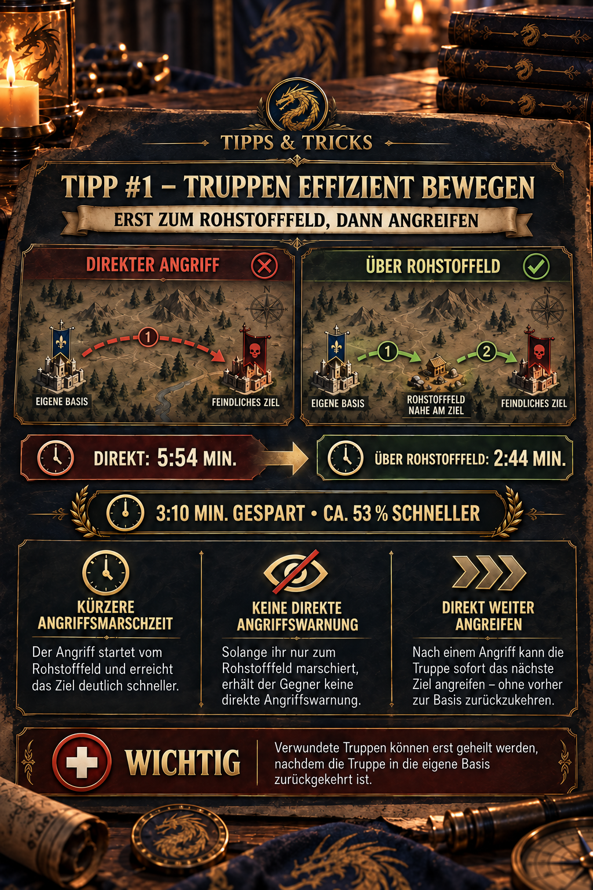

# 💡 Tipp #1 – Truppen effizient bewegen

## Das Wichtigste in Kürze

- **Angriff vorbereiten:** Schickt die Truppe zuerst zu einem Rohstofffeld nahe am Ziel und startet den eigentlichen Angriff erst von dort.
- **Reaktionszeit verkürzen:** Die letzte Angriffsstrecke wird kürzer und der Gegner hat weniger Zeit zum Reagieren. Die Truppe selbst erhält dadurch keinen Geschwindigkeitsbonus.
- **Direkt weiterkämpfen:** Nach einem Angriff kann eine noch einsatzfähige Truppe unmittelbar das nächste Ziel angreifen.
- **Schneller zurückziehen:** Lauft nach dem Angriff ein nahes Rohstofffeld an und drückt sofort „Rückzug“. Dadurch wird die schnellere Marschgeschwindigkeit des Rohstofffeld-Marsches für den Rückweg verwendet.
- **Heilung beachten:** Verwundete können erst nach der Rückkehr zur eigenen Basis geheilt werden.

> **Merksatz:** Rohstofffelder verkürzen den entscheidenden Weg – beim Angriff und beim Rückzug.



## Wofür ist dieser Tipp?

Der Tipp ist vor allem für geplante Angriffe auf weiter entfernte Ziele gedacht. Statt von der eigenen Basis direkt anzugreifen, nutzt ihr ein Rohstofffeld als **Zwischenstation beziehungsweise Wegpunkt**. Der Vorteil entsteht nicht durch eine höhere Marschgeschwindigkeit, sondern durch eine bessere Ausgangsposition für den eigentlichen Angriff.

Das hilft euch dabei,

- die letzte Angriffsstrecke deutlich zu verkürzen,
- dem Ziel weniger Zeit zum Reagieren zu geben,
- mehrere nahe beieinanderliegende Ziele nacheinander anzugreifen und
- eure Truppe nach einem Angriff flexibel auf der Karte weiterzubewegen oder schneller zurückzuholen.

## So funktioniert die Wegpunkt-Taktik

1. **Ziel auswählen:** Legt fest, welche Basis oder welches andere Ziel angegriffen werden soll.
2. **Rohstofffeld suchen:** Wählt ein möglichst nah gelegenes Rohstofffeld, das sich als unauffällige Zwischenstation eignet.
3. **Truppe vorschicken:** Marschiert zunächst zum Rohstofffeld und nicht direkt zum eigentlichen Ziel.
4. **Angriff vorbereiten:** Beobachtet den Marsch und prüft vor dem Angriff noch einmal Ziel, Marschzeit und Truppenstärke.
5. **Vom Wegpunkt angreifen:** Startet den Angriff erst aus der Nähe. Eine in der Community beschriebene Variante ist, den Marsch bereits kurz vor dem Rohstofffeld auf das eigentliche Ziel umzulenken.
6. **Danach entscheiden:** Greift ein weiteres Ziel in der Nähe an oder schickt die Truppe zurück zur Basis, wenn Verwundete geheilt werden sollen.

## Warum die Taktik funktioniert

### Kürzere Reaktionszeit statt höherer Geschwindigkeit

Ein Rohstofffeld erhöht nicht automatisch die Marschgeschwindigkeit. Die Truppe befindet sich nach der Vorpositionierung lediglich näher am Ziel. Dadurch ist die **letzte Angriffsstrecke** kürzer und der Gegner kann erst später auf den konkreten Angriff reagieren.

Solange die Truppe nur zu einem Rohstofffeld unterwegs ist, handelt es sich nicht um einen direkten Angriffsmarsch auf die Zielbasis. Die Truppe ist auf der Weltkarte trotzdem sichtbar. Die Methode macht einen Marsch daher **nicht unsichtbar**; sie tarnt zunächst nur die tatsächliche Absicht und verkürzt das Zeitfenster zwischen Angriffsbefehl und Einschlag.

### Mehrere Ziele ohne Rückweg angreifen

Nach einem Kampf muss die Truppe nicht grundsätzlich zuerst zur eigenen Basis zurückkehren. Ist sie noch einsatzfähig, kann sie direkt von ihrer aktuellen Position aus das nächste Ziel angreifen. Besonders bei mehreren Zielen in einem Gebiet spart das zusätzliche Wege.

> **Wichtig:** Verwundete Truppen können erst geheilt werden, nachdem die Truppe in die eigene Basis zurückgekehrt ist. Prüft deshalb nach jedem Kampf, ob ein weiterer Angriff den Zeitgewinn tatsächlich wert ist.

### Rohstofffeld für einen schnelleren Rückzug nutzen

Rohstofffelder helfen nicht nur beim Annähern. Nach einem Angriff könnt ihr sie auch nutzen, um die Truppe schneller zur Basis zurückzuholen:

1. Wählt nach dem Angriff ein **Rohstofffeld in der Nähe der aktuellen Truppenposition** aus.
2. Schickt die Truppe zu diesem Feld.
3. Drückt unmittelbar nach dem Start des Marsches auf **„Rückzug“**. Die Truppe muss das Rohstofffeld nicht erst erreichen.
4. Der Rückmarsch wird dadurch mit der Marschgeschwindigkeit des Rohstofffeld-Marsches ausgeführt und nicht mit der langsameren Geschwindigkeit eines direkten Basisanlaufs.

Ihr müsst dafür kein Rohstofffeld in der Nähe eurer eigenen Basis suchen. Entscheidend ist ein schnell erreichbares Feld nahe der Truppe, damit ihr den Rohstoffmarsch starten und sofort wieder abbrechen könnt.

> **Praxisnutzen:** Diese Variante bringt Verwundete schneller zurück ins Krankenhaus und macht die Truppe früher wieder verfügbar. Vergleicht vor dem Bestätigen kurz die angezeigte Rückmarschzeit, da Forschung, Boni und Spielupdates die Zeiten beeinflussen können.

## Beispiel aus der Grafik

| Vergleich | Marschzeit | Umgerechnet |
| --- | ---: | ---: |
| Direkter Angriff | 5:54 Min. | 354 Sekunden |
| Angriff vom Rohstofffeld | 2:44 Min. | 164 Sekunden |
| Ersparnis auf der Angriffsstrecke | **3:10 Min.** | **190 Sekunden** |

Die verkürzte Angriffsstrecke benötigt damit rund **53,7 % weniger Zeit**:

`(354 − 164) ÷ 354 × 100 = 53,7 %`

Anders ausgedrückt: Ab dem Angriffsbefehl beträgt die Wartezeit nur noch rund **46,3 %** der direkten Marschzeit. Der direkte Angriff dauert in diesem Beispiel etwa **2,16-mal so lange**. Die eigentliche Marschgeschwindigkeit der Truppe ändert sich dadurch nicht.

> **Einordnung:** Die Rechnung vergleicht den direkten Angriff mit dem Angriff **ab dem bereits erreichten Rohstofffeld**. Die Zeit für das vorherige Positionieren ist nicht enthalten. Bei einem einzelnen spontanen Angriff kann der Gesamtweg daher gleich lang oder sogar länger sein. Der taktische Gewinn entsteht vor allem durch die kürzere Reaktionszeit des Gegners, eine frühzeitige Positionierung oder mehrere aufeinanderfolgende Angriffe.

## Wann lohnt sich die Methode?

| Situation | Einschätzung |
| --- | --- |
| Der Angriff wird im Voraus geplant | **Sehr sinnvoll:** Die Truppe kann rechtzeitig und ohne direkten Angriffsbefehl in Zielnähe gebracht werden. |
| Mehrere Ziele stehen nah beieinander | **Sehr sinnvoll:** Nach dem ersten Kampf kann die Truppe direkt weiterziehen. |
| Der Gegner soll möglichst wenig Reaktionszeit erhalten | **Sinnvoll:** Die letzte Strecke und damit das konkrete Warnfenster werden kürzer. |
| Die Truppe soll nach dem Angriff schnell zurückkehren | **Sehr sinnvoll:** Ein nahes Rohstofffeld anlaufen und sofort „Rückzug“ wählen. |
| Es geht nur um einen sofortigen Einzelangriff | **Vorher vergleichen:** Vorpositionierung plus Schlussstrecke können zusammen länger dauern als der direkte Weg. |
| Die Truppe hat bereits viele Verwundete | **Eher zurückkehren:** Ohne Rückkehr zur Basis ist keine Heilung möglich. |

## Praktische Checkliste

- Liegt das Rohstofffeld wirklich näher am Ziel als eure aktuelle Position?
- Ist das Feld frei und kann die Truppe dort sicher ankommen?
- Wie lang ist die Schlussstrecke vom Rohstofffeld zum Ziel?
- Ist der Gegner aktiv und könnte den Marsch auf der Karte beobachten?
- Reicht die verbleibende Truppenstärke für den Angriff und ein mögliches zweites Ziel?
- Muss die Truppe danach zur Heilung zurück oder kann sie weiterkämpfen?
- Ist für den Rückzug ein Rohstofffeld nahe der aktuellen Truppenposition verfügbar?
- Ist der Rückmarsch über „Rohstofffeld anlaufen → sofort Rückzug“ tatsächlich kürzer als der direkte Basisanlauf?

## Grenzen und offene Punkte

- Die Taktik ist **keine Unsichtbarkeit**. Aufmerksame Spieler können den Marsch auf der Karte bemerken und die Absicht erraten.
- Sobald der eigentliche Angriff gestartet wird, solltet ihr davon ausgehen, dass das Ziel gewarnt werden kann. Wie genau und zu welchem Zeitpunkt Warnungen angezeigt werden, sollte nach größeren Spielupdates erneut im Spiel geprüft werden.
- Marschzeiten hängen von Entfernung, Forschung, aktiven Boni und der verwendeten Truppe ab. Die Werte 5:54 und 2:44 Minuten sind ein konkretes Praxisbeispiel und kein allgemeingültiger Zeitwert.
- Das Rohstofffeld dient der Positionierung. Wird es besetzt, geräumt oder anderweitig unbrauchbar, braucht ihr einen alternativen Wegpunkt.
- Auch die Rückzugsvariante beruht auf der derzeit beobachteten Ingame-Berechnung. Prüft nach Spielupdates die angezeigten Marschzeiten erneut.

## Quellen und Verlässlichkeit

- **DIE-Praxisbeispiel:** Die Zeiten, der Ablauf, der Heilungshinweis und die Rückzugsvariante stammen aus dem Praxiswissen der Allianz sowie der freigegebenen Allianz-Mitteilung und der zugehörigen Ingame-Grafik.
- **Community-Quelle:** [Z Route Academy – March Tactics: Waypoint Approaches](https://zroute.dev/combat/march-tactics/) beschreibt dieselbe Technik mit einem Rohstofffeld als Wegpunkt und führt sie mit Stand 14.09.2026 als „Community Verified“.
- **Offizielle Spielseite:** [Z Route: Redemption im Apple App Store](https://apps.apple.com/app/z-route-redemption/id6762268182). Eine offizielle, öffentlich zugängliche Detaildokumentation zu dieser Marschmechanik war bei der Recherche am 25.09.2026 nicht auffindbar.

Bei Abweichungen ist die aktuelle Anzeige im Spiel maßgeblich. Screenshots oder reproduzierbare Tests aus der Allianz sollten zur Aktualisierung des Artikels genutzt werden.

## Allianz-Mitteilung zum Kopieren

```html
<size=38><color=#8DAA2D><b>💡 TIPP #1 – TRUPPEN EFFIZIENT BEWEGEN</b></color></size>

Schickt eure Truppen zuerst auf ein <color=#8DAA2D><b>Rohstofffeld nahe am Ziel</b></color> und greift erst von dort an.

<b>Vorteile:</b>
⚔️ Deutlich kürzere Angriffsmarschzeit
👀 Keine direkte Angriffswarnung, solange ihr nur zum Rohstofffeld marschiert
➡️ Nach einem Angriff kann die Truppe direkt das nächste Ziel angreifen – ohne vorher zur Basis zurückzukehren.

<b>Beispiel:</b>
Direkt: 5:54 Min.
Über Rohstofffeld: 2:44 Min.
➡️ ca. <color=#8DAA2D><b>53 % schneller!</b></color>

<color=#D85B45><b>WICHTIG:</b></color> Verwundete Truppen können erst geheilt werden, nachdem die Truppe in die eigene Basis zurückgekehrt ist.
```
