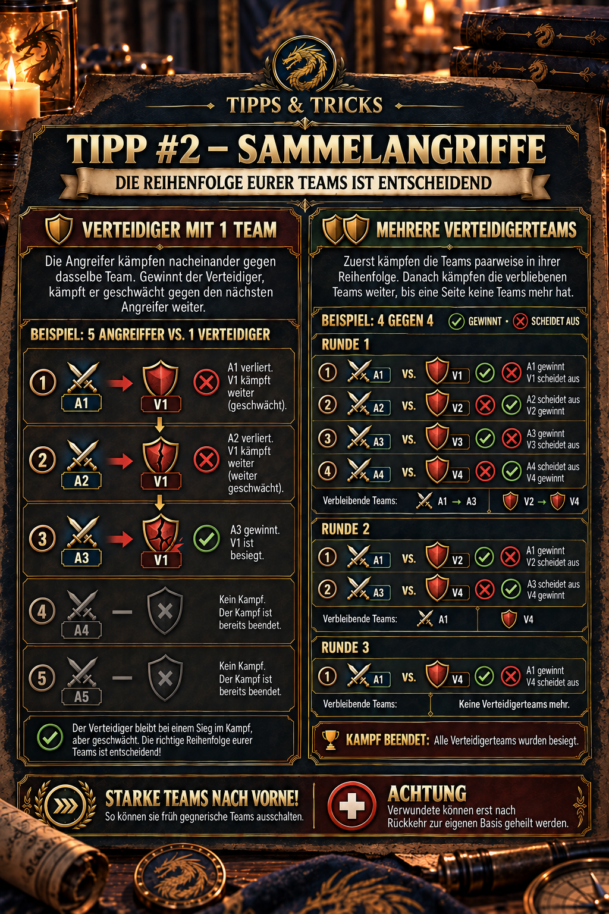

# 💡 Tipp #2 – Sammelangriffe

## Das Wichtigste in Kürze

- **Starke Teams nach vorne:** Die vorderen Teams kämpfen zuerst und können bei einem Sieg weitere Gegner ausschalten.
- **Nur ein Verteidigerteam:** Die Angreifer treten nacheinander gegen dasselbe, zunehmend geschwächte Team an.
- **Mehrere Verteidigerteams:** Zuerst kämpft A1 gegen V1, A2 gegen V2 und so weiter. Danach werden die verbliebenen Teams in ihrer bisherigen Reihenfolge erneut gepaart.
- **Gewinner kämpfen geschwächt weiter:** Bereits erlittener Schaden bleibt bestehen; Verwundete können erst nach der Rückkehr zur eigenen Basis geheilt werden.

> **Merksatz:** Position bestimmt den ersten Gegner – das Ergebnis bestimmt die nächste Runde.



## Wofür ist dieser Tipp?

Dieser Tipp erklärt die **Kampfreihenfolge innerhalb eines Sammelangriffs**. Wer die Reihenfolge versteht, kann besser entscheiden,

- welches Team an die erste Position gehört,
- warum nicht zwangsläufig jedes mitgeschickte Team tatsächlich kämpft,
- wie ein einzelnes Verteidigerteam von mehreren Angreifern nacheinander geschwächt wird,
- wie sich die Paarungen bei mehreren Verteidigern über mehrere Runden fortsetzen und
- weshalb ein ungünstig platziertes schwaches Team den gesamten Sammelangriff unnötig teuer machen kann.

Der Tipp bezieht sich auf die **Reihenfolge der vollständigen Spieler- beziehungsweise Marschteams im Sammelangriff**. Die Aufstellung der fünf Helden innerhalb eines einzelnen Teams ist eine zusätzliche Ebene und wird hier nicht behandelt.

## Begriffe und Grundregel

| Kürzel | Bedeutung |
| --- | --- |
| **A1, A2, A3 …** | Angreiferteam an Position 1, 2, 3 … |
| **V1, V2, V3 …** | Verteidigerteam an Position 1, 2, 3 … |
| **Runde** | Eine Folge von direkten Paarungen zwischen den aktuell verbliebenen Teams |
| **Verbliebenes Team** | Ein Team, das seine Begegnung gewonnen hat und deshalb weiterkämpfen kann |

Die erste Runde beginnt positionsgleich:

`A1 gegen V1 → A2 gegen V2 → A3 gegen V3 → A4 gegen V4 …`

Nach jeder Begegnung scheidet das besiegte Team aus. Das siegreiche Team bleibt mit seinem verbleibenden Zustand im Kampf. Sind anschließend auf beiden Seiten noch Teams vorhanden, werden die Überlebenden **in ihrer bisherigen Reihenfolge** erneut gepaart. Das wiederholt sich, bis auf einer Seite kein Team mehr übrig ist.

> **Merksatz:** Die Position bestimmt den ersten Gegner. Das Ergebnis bestimmt, wer in der nächsten Runde erneut antritt.

## Fall 1: Der Verteidiger hat nur ein Team

Steht nur ein Verteidigerteam bereit, kämpfen die Angreifer nacheinander gegen genau dieses Team. Gewinnt der Verteidiger eine Begegnung, bleibt er für den nächsten Angreifer stehen – allerdings mit den Verlusten und dem Schaden aus den vorherigen Kämpfen.

### Beispielablauf

| Begegnung | Ergebnis im Beispiel | Folge |
| --- | --- | --- |
| A1 gegen V1 | V1 gewinnt | A1 scheidet aus; V1 kämpft geschwächt weiter. |
| A2 gegen V1 | V1 gewinnt erneut | A2 scheidet aus; V1 ist weiter geschwächt. |
| A3 gegen V1 | A3 gewinnt | V1 scheidet aus; die Verteidigung ist beendet. |
| A4 und weitere | Kein Kampf mehr | Es gibt kein Verteidigerteam mehr. |

Dieses Beispiel zeigt zwei wichtige Punkte:

1. Früh eingesetzte Angreifer können ein starkes Verteidigerteam bereits schwächen, selbst wenn sie verlieren.
2. Sobald der letzte Verteidiger besiegt ist, endet der Kampf. Später eingereihte Angreifer werden dann nicht mehr eingesetzt.

## Fall 2: Beide Seiten haben mehrere Teams

Bei mehreren Verteidigerteams beginnt der Kampf mit positionsgleichen Paarungen. Danach treten nur die Gewinner erneut an.

### Runde 1 – ursprüngliche Reihenfolge

Für das folgende reine Ablaufbeispiel nehmen wir diese Ergebnisse an:

| Paarung | Beispielergebnis | Verbleibt im Kampf |
| --- | --- | --- |
| A1 gegen V1 | A1 gewinnt | A1 |
| A2 gegen V2 | V2 gewinnt | V2 |
| A3 gegen V3 | A3 gewinnt | A3 |
| A4 gegen V4 | V4 gewinnt | V4 |

Nach Runde 1 sind damit noch vorhanden:

- **Angreifer:** A1, A3
- **Verteidiger:** V2, V4

### Runde 2 – Überlebende werden neu gepaart

Die verbliebenen Teams behalten ihre relative Reihenfolge:

| Paarung | Beispielergebnis | Verbleibt im Kampf |
| --- | --- | --- |
| A1 gegen V2 | A1 gewinnt | A1 |
| A3 gegen V4 | V4 gewinnt | V4 |

### Runde 3 – Entscheidung

Nun sind nur noch A1 und V4 übrig:

`A1 gegen V4 → der Gewinner entscheidet den Sammelangriff.`

Die genannten Gewinner sind nur ein Rechenbeispiel, damit die Reihenfolge sichtbar wird. Im Spiel hängen die tatsächlichen Ergebnisse unter anderem von Helden, Soldaten, Forschung, Ausrüstung, Boni, Kontern und dem bereits erlittenen Schaden ab.

## Warum starke Teams nach vorne gehören

Ein starkes Team auf Position 1 kann mehr als nur seine erste Paarung gewinnen. Bleibt es kampffähig, kann es in späteren Runden weitere gegnerische Teams ausschalten. Dadurch

- werden gefährliche Verteidiger früh entfernt,
- müssen weniger nachfolgende Angreifer kämpfen,
- sinken häufig die Gesamtverluste des Sammelangriffs und
- bleiben mehr Teams vollständig oder weitgehend unbeschädigt.

„Stark“ bedeutet dabei nicht nur die höchste angezeigte Kampfkraft. Entscheidend sind auch:

- aktuelle Truppenstärke und bereits vorhandene Verluste,
- Heldenrollen und Positionen innerhalb des Teams,
- passende Formation und Fraktionsbonus,
- Forschung, Ausrüstung und aktive Kampfboni sowie
- mögliche Stärken oder Schwächen gegenüber dem gegnerischen Team.

> **Standardregel:** Wenn ihr keine genaueren Informationen über die Verteidigung habt, stellt das stärkste verlässlich einsatzbereite Team zuerst. Eine gezielte Konteraufstellung kann im Einzelfall sinnvoller sein als die rein höchste Kampfkraft.

## Was die Allianz vor dem Start abstimmen sollte

1. **Ziel und Zweck festlegen:** Geht es um einen sicheren Sieg, das Schwächen eines starken Verteidigers oder möglichst geringe Verluste?
2. **Stärkstes verfügbares Team bestimmen:** Kampfkraft allein reicht nicht; Truppenstand und Formation müssen ebenfalls stimmen.
3. **Angezeigte Reihenfolge prüfen:** Kontrolliert vor dem Start, welches Team tatsächlich auf A1, A2, A3 und so weiter steht.
4. **Unpassende Teams vermeiden:** Ein schwaches oder bereits stark beschädigtes Team sollte keinen wichtigen vorderen Platz blockieren.
5. **Nach dem Kampf Bericht auswerten:** Prüft die tatsächlichen Paarungen, Gewinner und verbliebenen Truppen. Nur so lässt sich erkennen, ob die angenommene Reihenfolge noch gilt und welche Aufstellung verbessert werden muss.

Wie die Positionen in der aktuellen Benutzeroberfläche konkret vergeben oder verändert werden können, sollte direkt vor dem Start im Sammelangriffsfenster geprüft werden. Verlasst euch nicht allein auf die Reihenfolge, in der Spieler im Allianzchat ihre Teilnahme angekündigt haben.

## Typische Fehlannahmen

### „Alle mitgeschickten Teams kämpfen auf jeden Fall“

Nein. Ist die gegnerische Seite bereits vollständig besiegt, endet der Kampf. Nachfolgende Teams können deshalb ohne eigene Begegnung übrig bleiben.

### „Nur der erste Kampf zählt“

Nein. Gewinner können in weiteren Runden erneut antreten. Ein frühes starkes Team kann deshalb mehrere Gegner beeinflussen oder ausschalten.

### „Die höchste Kampfkraft gewinnt automatisch“

Nicht zwingend. Zusammensetzung, Truppenbestand, Ausrüstung, Forschung, Boni und Vorschäden beeinflussen das Ergebnis. Nutzt Kampfberichte statt nur einer einzelnen Machtzahl.

### „Ein verlorenes Team war nutzlos“

Nicht unbedingt. Ein unterlegenes Team kann dem Gegner bereits Schaden zufügen und ihn für den nächsten Angreifer schwächen. Trotzdem ist ein bewusstes Opferteam keine allgemeine Standardempfehlung: Schlechte Reihenfolge kann unnötige Verwundete erzeugen und einen starken Gegner länger im Kampf halten.

## Verwundete und Folgeangriffe

Die Reihenfolge beeinflusst nicht nur den Sieg, sondern auch die Verteilung der Verluste. Teams, die früh und mehrfach kämpfen, können entsprechend mehr Verwundete ansammeln. Nach dem Sammelangriff gilt:

> **Achtung:** Verwundete können erst nach der Rückkehr zur eigenen Basis geheilt werden.

Plant deshalb nicht nur den ersten Angriff. Berücksichtigt auch Rückmarsch, Krankenhauskapazität und die Frage, ob unmittelbar danach ein weiterer Sammelangriff vorgesehen ist.

## Praktische Auswertung nach einem Sammelangriff

Haltet im Kampfbericht mindestens diese Punkte fest:

- Welche Teams standen tatsächlich auf A1, A2, A3 beziehungsweise V1, V2, V3?
- Welche erste Paarung wurde für jedes Team angezeigt?
- Welche Gewinner traten in einer weiteren Runde erneut an?
- Mit welchem verbleibenden Truppenstand gingen sie in den nächsten Kampf?
- Welche Teams wurden gar nicht mehr eingesetzt?
- Hätte eine andere Reihenfolge Verluste vermieden oder einen früheren Sieg ermöglicht?

Ein einzelner Bericht zeigt einen Ablauf. Mehrere Berichte mit denselben Paarungsregeln machen daraus belastbares Allianz-Wissen.

## Grenzen und offene Punkte

- Die genaue Paarungslogik stammt aus Ingame-Beobachtungen und dem Praxiswissen der Allianz; eine offizielle öffentliche Detailbeschreibung war bei der Recherche nicht auffindbar.
- Benutzeroberfläche und Sortiermöglichkeiten können sich durch Updates ändern. Prüft deshalb die angezeigten Positionen unmittelbar vor dem Start.
- Noch zu bestätigen ist, ob es in allen Sammelangriffsarten exakt dieselbe Reihenfolge gibt oder ob einzelne Events beziehungsweise Ziele Sonderregeln verwenden.
- Kampfwerte allein erklären nicht jedes Ergebnis. Bei Abweichungen ist der aktuelle Ingame-Kampfbericht maßgeblich.

## Quellen und Verlässlichkeit

- **DIE-Praxiswissen:** Die Paarungslogik, der Ablauf mit einem oder mehreren Verteidigern und der Heilungshinweis stammen aus der freigegebenen Allianz-Mitteilung sowie der zugehörigen Grafik.
- **Community-Quelle:** [Z Route Academy – Truppstufung und Zusammensetzung](https://zroute.dev/de/getting-started/squad-leveling-composition/) empfiehlt, den Haupttrupp zuerst auszubauen, Helden korrekt zu positionieren und schwierige Kämpfe über Kampfberichte auszuwerten. Die Seite kennzeichnet ihre Angaben transparent nach Verlässlichkeit.
- **Weiterführende Community-Lektüre:** Das [Season-1-Strategiehandbuch bei Scribd](https://www.scribd.com/document/1071138090/Z-Route-Redemption-Season-1-Complete-Strategy-Handbook-Published-2) empfiehlt für priorisierte Sammelangriffe das stärkste geeignete verfügbare Team, schnelle Koordination und anschließende Truppenregeneration. Es beschreibt jedoch nicht die hier dargestellte Paarungslogik im Detail.

Stand der Recherche: **25.09.2026**. Bei Widersprüchen haben aktuelle Ingame-Anzeigen und reproduzierbare Kampfberichte Vorrang.

## Allianz-Mitteilung zum Kopieren

```html
<size=38><color=#8DAA2D><b>💡 TIPP #2 – SAMMELANGRIFFE</b></color></size>

Bei Sammelangriffen ist die <color=#8DAA2D><b>Reihenfolge eurer Teams entscheidend!</b></color>

<b>Verteidiger mit 1 Team:</b>
Die Angreifer kämpfen nacheinander gegen dasselbe Team. Gewinnt der Verteidiger, kämpft er geschwächt gegen den nächsten Angreifer weiter.

<b>Mehrere Verteidigerteams:</b>
A1 vs. V1 → A2 vs. V2 → A3 vs. V3 usw.
Danach kämpfen die verbliebenen Teams in ihrer Reihenfolge weiter, bis eine Seite keine Teams mehr hat.

➡️ <color=#8DAA2D><b>Starke Teams nach vorne!</b></color> So können sie früh gegnerische Teams ausschalten.

<color=#D85B45><b>ACHTUNG:</b></color> Verwundete können erst nach Rückkehr zur eigenen Basis geheilt werden.
```
