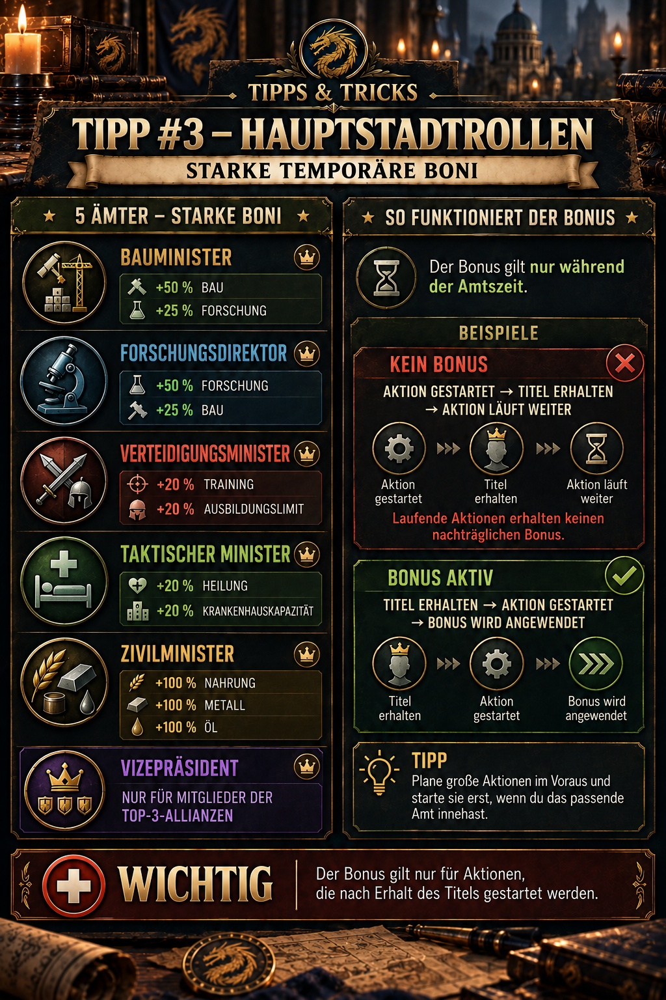

---
arten:
  - Anleitung
  - Optimierung
themen:
  - Allianz
  - Aufbau
---

# 💡 Tipp #3 – Hauptstadtrollen

## Das Wichtigste in Kürze

- **Passende Rolle wählen:** Bau, Forschung, Training, Heilung und Ressourcen haben jeweils eine eigene Hauptstadtrolle.
- **Erst Titel, dann Aktion:** Bereits laufende Bau-, Forschungs-, Trainings- oder Heilvorgänge erhalten den Bonus nicht nachträglich.
- **Große Aktionen vorbereiten:** Haltet Ressourcen, Voraussetzungen und eine freie Warteschlange bereit, bevor ihr den Titel bekommt.
- **Aktivierung kontrollieren:** Prüft vor dem Start, ob der Titel wirklich aktiv ist und ob die angezeigte Dauer beziehungsweise Kapazität gesunken oder gestiegen ist.
- **Vizepräsident:** Dieser Titel ist nur für Mitglieder einer Top-3-Allianz verfügbar.

> **Merksatz:** Erst ernennen lassen, Bonus kontrollieren, dann die große Aktion starten.



## Wofür ist dieser Tipp?

Die Hauptstadtrollen geben ihren Inhabern starke, aber zeitlich begrenzte Boni. Richtig eingesetzt können sie lange Bau- und Forschungsvorgänge verkürzen, größere Trainingsblöcke ermöglichen, die Heilung nach schweren Kämpfen verbessern oder die Ressourcenproduktion erhöhen.

Der entscheidende Punkt ist das **Timing**: Ein Titel wirkt nicht rückwirkend auf eine bereits laufende Aktion. Deshalb sollte vor der Ernennung alles vorbereitet sein, damit der gewünschte Vorgang unmittelbar nach Erhalt des Titels gestartet werden kann.

## Übersicht der Hauptstadtrollen

| Hauptstadtrolle | Angegebene Boni | Besonders geeignet für |
| --- | --- | --- |
| 🏗️ **Bauminister** | +50 % Baugeschwindigkeit · +25 % Forschungsgeschwindigkeit | lange Gebäude- oder Basisaufwertungen; ersatzweise größere Forschung |
| 🔬 **Forschungsdirektor** | +50 % Forschungsgeschwindigkeit · +25 % Baugeschwindigkeit | lange Technologien; ersatzweise größere Gebäudeaufwertung |
| ⚔️ **Verteidigungsminister** | +20 % Trainingsgeschwindigkeit · +20 % Ausbildungslimit | große Soldatenausbildung, Vorbereitung auf Kampf- oder Wertungsevents |
| 🏥 **Taktischer Minister** | +20 % Heilungsgeschwindigkeit · +20 % Krankenhauskapazität | Heilung nach großen Kämpfen und vor weiteren Gefechten |
| 🌾 **Zivilminister** | +100 % Nahrung, Metall und Öl | Phasen mit hoher Ressourcenproduktion beziehungsweise -abholung |

Die Tabelle übernimmt die in der Allianz-Grafik dokumentierten Werte. Da Spielversionen und Übersetzungen abweichen können, ist die aktuelle Rollenanzeige im Spiel immer maßgeblich.

## Die wichtigste Regel: Der Startzeitpunkt entscheidet

Für Bau, Forschung, Training und Heilung gilt nach den bisherigen Ingame-Beobachtungen:

| Reihenfolge | Ergebnis |
| --- | --- |
| Aktion starten → Titel erhalten | **Kein nachträglicher Bonus** für die bereits laufende Aktion |
| Titel erhalten → Aktion starten | **Bonus wird beim Start berücksichtigt** |

### Kein Bonus auf bereits laufende Aktionen

Wenn ein Bauprojekt bereits läuft und ihr erst danach Bauminister werdet, wird die verbleibende Bauzeit nicht automatisch neu berechnet. Das Gleiche gilt entsprechend für bereits gestartete Forschung, Ausbildung und Heilung.

### Aktion während der Amtszeit starten

Lasst euch zuerst ernennen und kontrolliert anschließend die angezeigte Dauer oder Kapazität. Startet den vorbereiteten Vorgang erst, wenn der Titel sichtbar aktiv ist.

Eine Community-Quelle berichtet, dass eine während der Amtszeit gestartete Aktion ihre verkürzte Dauer behält, auch wenn der Titel vor Abschluss der Aktion endet. Das passt zur beobachteten Startlogik, ist in der vorliegenden Ingame-Grafik aber nicht ausdrücklich belegt. Prüft deshalb bei Gelegenheit den Timer vor und nach dem Ende einer Amtszeit und dokumentiert das Ergebnis.

## Vorbereitung vor der Ernennung

Ein starker Titel bringt wenig, wenn während der kurzen Amtszeit noch Ressourcen gesucht, Voraussetzungen erfüllt oder Warteschlangen freigemacht werden müssen. Bereitet deshalb Folgendes vor:

1. **Passende Aktion auswählen:** Entscheidet vorab, welches Gebäude, welche Forschung, welcher Trainingsblock oder welche Heilung gestartet werden soll.
2. **Voraussetzungen prüfen:** Benötigte Gebäudelevel, Forschungen oder freie Krankenhausplätze müssen bereits vorhanden sein.
3. **Ressourcen bereitstellen:** Öffnet Ressourcenkisten nur soweit nötig und stellt sicher, dass alle Kosten gedeckt sind.
4. **Warteschlange freihalten:** Bau-, Forschungs-, Trainings- oder Heilungsplatz muss zum Zeitpunkt der Ernennung verfügbar sein.
5. **Mit der Führung abstimmen:** Meldet, welche Rolle benötigt wird und wann ihr startbereit seid.
6. **Titel kontrollieren:** Öffnet nach der Ernennung die Rollen- oder Profilanzeige und prüft, ob der richtige Titel aktiv ist.
7. **Vorschau vergleichen:** Kontrolliert die angezeigte Dauer, Produktionsmenge oder Kapazität vor dem endgültigen Start.
8. **Aktion starten:** Erst jetzt den vorbereiteten Vorgang bestätigen.

> **Praxisregel:** Nicht erst nach der Ernennung planen. Die Amtszeit ist zum Starten da, nicht zum Suchen.

## Welche Rolle für welche Aktion?

### Bauminister

Der Bauminister ist die erste Wahl für eine möglichst lange oder teure Gebäudeaufwertung. Besonders wertvoll ist er bei Projekten, die mehrere Tage dauern oder den weiteren Basisfortschritt blockieren.

Ist gerade kein großes Bauprojekt möglich, kann der zusätzliche Forschungsbonus trotzdem nützlich sein. Für eine wirklich lange Forschung ist der Forschungsdirektor jedoch die stärkere Rolle.

### Forschungsdirektor

Der Forschungsdirektor sollte für lange Technologien eingesetzt werden. Bereitet die Forschung vollständig vor und achtet darauf, dass keine andere Technologie die Warteschlange blockiert.

Der zusätzliche Baubonus ist eine gute Ausweichmöglichkeit, erreicht aber nicht den Hauptbonus des Bauministers.

### Verteidigungsminister

Diese Rolle kombiniert schnelleres Training mit einem größeren Ausbildungslimit. Der größte Nutzen entsteht deshalb bei einem möglichst großen vorbereiteten Trainingsblock.

Prüft vor dem Start sowohl die angezeigte Soldatenzahl als auch die Trainingsdauer. So erkennt ihr, ob beide Teile des Bonus aktiv sind. Besonders sinnvoll ist die Rolle vor Kampfphasen oder an Eventtagen, an denen Ausbildung Punkte bringt.

### Taktischer Minister

Der Taktische Minister verbessert Heilungsgeschwindigkeit und Krankenhauskapazität. Nutzt ihn vorzugsweise nach schweren Kämpfen oder unmittelbar vor einer weiteren geplanten Kampfphase.

Bei der zusätzlichen Krankenhauskapazität ist Vorsicht sinnvoll: Solange nicht reproduzierbar geprüft wurde, wie das Spiel mit einer nach Amtsende wieder sinkenden Kapazität umgeht, sollte das Krankenhaus nicht absichtlich weit über die normale Kapazität hinaus belastet werden.

### Zivilminister

Der Zivilminister erhöht die Produktion von Nahrung, Metall und Öl. Im Unterschied zu Bau, Forschung, Training und Heilung handelt es sich dabei nicht eindeutig um eine einmalig gestartete Warteschlangenaktion.

Deshalb sollte im Spiel geprüft werden,

- ob der Bonus nur während der aktiven Amtszeit produziert,
- ob der Zeitpunkt der Abholung eine Rolle spielt und
- wie der Bonus mit bereits vorhandenen Produktionsboni verrechnet wird.

Die vorliegende Grafik bestätigt die Höhe von +100 %, aber nicht die genaue Abrechnungslogik. Bis ein reproduzierbarer Test vorliegt, sollte hier keine weitergehende Behauptung als gesicherte Regel verwendet werden.

## Geschwindigkeitsbonus richtig lesen

Ein Bonus von **+50 % Geschwindigkeit** bedeutet nicht automatisch **50 % weniger Zeit**. Bei einer einfachen additiven Berechnung würde eine Aktion mit 100 Einheiten Grundgeschwindigkeit anschließend mit 150 Einheiten laufen. Die Dauer läge dann bei ungefähr zwei Dritteln der ursprünglichen Zeit – also rund 33 % Zeitersparnis.

Bereits vorhandene Boni aus Forschung, VIP, Ausrüstung oder Events können die tatsächliche zusätzliche Ersparnis weiter verändern. Deshalb ist die im Spiel angezeigte Vorschau zuverlässiger als eine pauschale Umrechnung.

### Vereinfachtes Rechenbeispiel

Unter der Annahme einer einfachen additiven Berechnung und ohne weitere Boni:

| Geschwindigkeitsbonus | Verbleibende Dauer | Ungefähre Zeitersparnis |
| ---: | ---: | ---: |
| +20 % | 83,3 % | 16,7 % |
| +25 % | 80,0 % | 20,0 % |
| +50 % | 66,7 % | 33,3 % |

Diese Tabelle ist eine mathematische Orientierung und keine bestätigte Spielformel. Verwendet für die tatsächliche Planung immer die Ingame-Zeitanzeige.

## Vizepräsident und Top-3-Allianzen

Der Titel **Vizepräsident** ist nach dem dokumentierten Ingame-Hinweis ausschließlich für Mitglieder der drei bestplatzierten Allianzen verfügbar.

Der vorliegende Tipp nennt für den Vizepräsidenten keinen konkreten Bonus. Deshalb wird aus der Zugangsvoraussetzung keine zusätzliche Wirkung abgeleitet. Für eine vollständige Dokumentation werden noch ein Screenshot der Rollenbeschreibung und die dort angezeigten Werte benötigt.

## Empfohlener Ablauf in der Allianz

Damit möglichst viele Mitglieder profitieren können, empfiehlt sich ein klarer Ablauf:

1. Mitglieder melden Rolle und geplante Aktion an.
2. Nur vollständig vorbereitete Spieler werden in die aktuelle Vergaberunde aufgenommen.
3. Ein Verantwortlicher vergibt die Rollen nacheinander.
4. Der Empfänger bestätigt kurz, dass der Titel sichtbar ist.
5. Die vorbereitete Aktion wird sofort gestartet.
6. Der erfolgreiche Start wird bestätigt, damit die Rolle weitergegeben werden kann.

Für besonders gefragte Rollen helfen eine Warteliste oder feste Vergabezeiten. Dadurch wird keine Amtszeit damit verschwendet, dass ein Empfänger noch Ressourcen oder Voraussetzungen suchen muss.

## Typische Fehler

- **Aktion zu früh gestartet:** Ein laufender Vorgang erhält den Bonus nicht rückwirkend.
- **Falsche Rolle beantragt:** +25 % Nebenbonus ist schwächer als der passende +50-%-Hauptbonus.
- **Warteschlange blockiert:** Während der Ernennung kann die vorbereitete Aktion nicht gestartet werden.
- **Titel nicht kontrolliert:** Aktion wird ausgelöst, bevor die Ernennung tatsächlich aktiv ist.
- **Prozentwert falsch verstanden:** Geschwindigkeitsbonus wird mit identischer Zeitersparnis verwechselt.
- **Ungeprüfte Sonderregel übernommen:** Community-Angaben werden verwendet, ohne sie mit der aktuellen Ingame-Anzeige abzugleichen.

## Grenzen und noch zu prüfende Angaben

- Die Rollenwerte aus der Allianz-Grafik sind dokumentiert, können sich aber durch Spielupdates ändern.
- Die genaue Amtsdauer ist in der Grafik nicht angegeben. Z Route Academy berichtet von ungefähr einer Minute; dies sollte im Spiel mit Serverzeit überprüft werden.
- Z Route Academy nennt zusätzlich einen gemeinsamen Grundbonus von +50 % auf Forschung, Bau und Training für jede Ministerrolle. Dieser Zusatz ist in der vorliegenden Ingame-Grafik nicht belegt und bleibt deshalb **ungeklärt**.
- Noch zu testen ist, ob gestartete Aktionen ihre verkürzte Dauer nach Amtsende in allen Bereichen sicher behalten.
- Die genaue Abrechnung des Zivilminister-Bonus und das Verhalten einer temporär erhöhten Krankenhauskapazität nach Amtsende benötigen reproduzierbare Tests.
- Die Top-3-Voraussetzung des Vizepräsidenten stammt aus dem Ingame-Hinweis; seine konkreten Vorteile sind noch nicht dokumentiert.

## Quellen und Verlässlichkeit

- **DIE-Ingame-Beleg:** Rollenbezeichnungen, die in der Tabelle aufgeführten Boni, die Top-3-Einschränkung des Vizepräsidenten und die Regel „Titel zuerst, Aktion danach“ stammen aus der freigegebenen Allianz-Mitteilung und der zugehörigen Ingame-Grafik.
- **Community-Quelle:** [Z Route Academy – Offizielle Positionen (Minister)](https://zroute.dev/de/alliance/official-positions/) führt dieselben fünf Ministerrollen und Prozentwerte als „Von der Community bestätigt“. Aussagen zur ungefähr einminütigen Amtszeit, zum Fortbestand gestarteter Boni und zum zusätzlichen gemeinsamen Grundbonus werden hier wegen fehlender eigener Ingame-Belege ausdrücklich als noch zu prüfen behandelt.
- **Ergänzende Quelle:** [Z Route Academy – Forschung](https://zroute.dev/city/research/) beschreibt weitere dauerhafte Bau-, Forschungs-, Trainings- und Heilungsboni. Das erklärt, warum die tatsächliche Zeitersparnis je nach Konto von einfachen Beispielrechnungen abweichen kann.

Stand der Recherche: **25.09.2026**. Bei Abweichungen gelten die aktuelle Ingame-Rollenbeschreibung und die unmittelbar vor dem Start angezeigten Werte.

## Allianz-Mitteilung zum Kopieren

```html
<size=38><color=#8DAA2D><b>💡 TIPP #3 – HAUPTSTADTROLLEN</b></color></size>

Die Hauptstadt bietet starke temporäre Boni:

🏗️ <b>Bauminister:</b> +50 % Bau / +25 % Forschung
🔬 <b>Forschungsdirektor:</b> +50 % Forschung / +25 % Bau
⚔️ <b>Verteidigungsminister:</b> +20 % Training / +20 % Ausbildungslimit
🏥 <b>Taktischer Minister:</b> +20 % Heilung / +20 % Krankenhauskapazität
🌾 <b>Zivilminister:</b> +100 % Nahrung, Metall & Öl

👑 <b>Vizepräsident:</b> nur für Mitglieder der Top-3-Allianzen.

<color=#D85B45><b>WICHTIG:</b></color> Der Bonus gilt nur während der Amtszeit und nur für Aktionen, die <color=#8DAA2D><b>nach Erhalt des Titels gestartet</b></color> werden.
```
