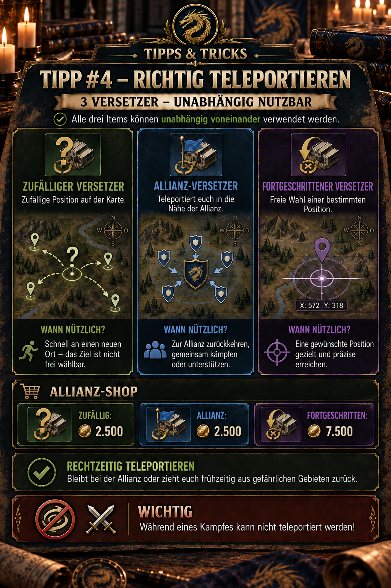

# 💡 Tipp #4 – Richtig teleportieren

## Das Wichtigste in Kürze

- **Zufälliger Versetzer:** günstig, platziert eure Basis aber an einer zufälligen Position am Rand der Karte.
- **Allianz-Versetzer:** bringt eure Basis in die Nähe der Allianz und ist meist die beste Wahl zum schnellen Gruppieren.
- **Fortgeschrittener Versetzer:** erlaubt eine gezielte Position, kostet mit 7.500 Allianzmünzen aber dreimal so viel.
- **Unabhängige Gegenstände:** Die drei Versetzer sind eigenständige Teleport-Items und keine aufeinander aufbauenden Stufen.
- **Nicht zu spät reagieren:** Während eines Kampfes kann nicht teleportiert werden. Zieht euch rechtzeitig zurück.

> **Merksatz:** Zufällig für Flexibilität, Allianz zum Gruppieren, fortgeschritten für den exakten Platz.



## Wofür ist dieser Tipp?

Dieser Tipp hilft bei der Wahl des richtigen Versetzers. Alle drei Gegenstände bewegen eure Basis, unterscheiden sich aber deutlich darin, **wo** ihr landet und wie viele Allianzmünzen der Einsatz kostet.

Richtig eingesetzt helfen Versetzer dabei,

- schnell zur Allianz zurückzukehren,
- Marschzeiten zu gemeinsamen Zielen zu verkürzen,
- eine abgestimmte Position in der Allianzformation einzunehmen,
- gefährliche Gebiete rechtzeitig zu verlassen und
- teure fortgeschrittene Versetzer nur dann einzusetzen, wenn eine genaue Position wirklich notwendig ist.

## Die drei Versetzer im direkten Vergleich

| Versetzer | Zielposition | Preis im Allianz-Shop | Typischer Einsatz |
| --- | --- | ---: | --- |
| ❓ **Zufälliger Versetzer** | zufälliger Ort am Rand der Karte | 2.500 | schnelle, günstige Verlagerung ohne Anspruch auf eine bestimmte Position |
| 🚩 **Allianz-Versetzer** | vom Spiel gewählte Position in der Nähe der Allianz | 2.500 | zur Allianz zurückkehren, gemeinsam kämpfen oder unterstützen |
| 📍 **Fortgeschrittener Versetzer** | gezielt ausgewählte freie Position | 7.500 | exakte Platzierung, abgestimmte Formation oder strategischer Standort |

Ein fortgeschrittener Versetzer kostet damit genauso viel wie **drei zufällige oder drei Allianz-Versetzer**. Der höhere Preis bezahlt nicht eine stärkere Teleportwirkung, sondern die Kontrolle über die genaue Zielposition.

## Was „unabhängig voneinander“ bedeutet

Die drei Versetzer sind unterschiedliche Gegenstände mit jeweils eigenem Zweck. Ihr müsst nicht zuerst einen zufälligen und danach einen Allianz-Versetzer verwenden, um den fortgeschrittenen Versetzer nutzen zu können.

Wählt direkt den Gegenstand, der zu eurem Ziel passt. Ein unnötiger Zwischenteleport kostet nur ein weiteres Item und kann euch an eine schlechtere Position bringen.

## Zufälliger Versetzer

Der zufällige Versetzer ist günstig, gibt euch aber keine Kontrolle über den Zielort. Eure Basis wird an einer **zufälligen Position am Rand der Karte** platziert. Er eignet sich, wenn eine schnelle Ortsveränderung wichtiger ist als die genaue Position und ihr bewusst außerhalb der zentralen Kartenbereiche landen möchtet.

### Sinnvolle Situationen

- Ihr möchtet ein Gebiet verlassen und müsst nicht bei einer bestimmten Koordinate landen.
- Ihr wollt eure Position verändern, ohne einen teuren fortgeschrittenen Versetzer einzusetzen.
- Die neue Position dient nur als vorübergehender Standort.

### Grenzen

- Die zufällige Randposition kann weit von der Allianz und wichtigen Kartenobjekten entfernt sein.
- Der neue Standort ist nicht automatisch sicher oder strategisch sinnvoll.
- Ein zweiter Teleport kann notwendig werden, wenn das Ergebnis unbrauchbar ist.

> **Entscheidungshilfe:** Wenn ihr anschließend ohnehin zur Allianz möchtet, ist der gleich teure Allianz-Versetzer meist die sinnvollere Wahl.

## Allianz-Versetzer

Der Allianz-Versetzer bringt euch in die Nähe der Allianz. Er ist die Standardwahl, wenn ihr abseits der Gruppe steht und wieder gemeinsam mit den anderen Mitgliedern spielen möchtet.

### Sinnvolle Situationen

- Ihr seid nach einem Ereignis oder einer Verlagerung weit von der Allianz entfernt.
- Die Allianz sammelt sich für einen gemeinsamen Angriff oder eine Verteidigung.
- Ihr möchtet Unterstützungen und gemeinsame Ziele mit kürzeren Marschzeiten erreichen.
- Ihr wollt euch aus einem gefährlichen Gebiet in Richtung der eigenen Gruppe zurückziehen.

### Grenzen

„In der Nähe der Allianz“ bedeutet nicht automatisch den von euch bevorzugten exakten Platz. Das Spiel bestimmt die Zielposition nach seinen Platzierungsregeln und den verfügbaren freien Flächen.

Wenn für eine Formation eine bestimmte Lücke, Reihe oder Koordinate benötigt wird, ist der fortgeschrittene Versetzer die verlässlichere Wahl.

## Fortgeschrittener Versetzer

Der fortgeschrittene Versetzer ermöglicht die freie Wahl einer bestimmten verfügbaren Position. Er ist damit das präziseste, aber auch teuerste der drei Items.

### Sinnvolle Situationen

- Ihr sollt eine vorher abgesprochene Koordinate einnehmen.
- Die Allianz baut eine geordnete Formation um ein Ziel oder ein starkes Mitglied auf.
- Ihr möchtet bewusst eine Position mit kurzen Marschwegen zu einem Ereignis oder Kampfgebiet wählen.
- Ein Allianz-Versetzer würde euch zwar in die richtige Gegend, aber nicht zuverlässig an den benötigten Platz bringen.

### Vor dem Bestätigen prüfen

- Ist die ausgewählte Fläche tatsächlich frei?
- Liegt die Position innerhalb der vereinbarten Allianzformation?
- Sind Gegner oder andere Gefahren in unmittelbarer Nähe?
- Sind wichtige Ziele von dort aus mit kurzen Wegen erreichbar?
- Ist die genaue Position den Aufpreis von 5.000 Allianzmünzen gegenüber dem Allianz-Versetzer wert?

## Welchen Versetzer sollte ich wählen?

| Ziel | Empfohlener Versetzer | Begründung |
| --- | --- | --- |
| Einfach nur den aktuellen Ort verlassen | **Zufälliger Versetzer** | günstig, wenn die Zielposition egal ist |
| Zur eigenen Allianz zurückkehren | **Allianz-Versetzer** | gleicher Preis wie zufällig, aber mit passender Zielrichtung |
| Gemeinsam kämpfen oder unterstützen | **Allianz-Versetzer** | verkürzt in der Regel die Wege zur Gruppe |
| Eine genaue Koordinate besetzen | **Fortgeschrittener Versetzer** | nur dieser Versetzer gibt gezielte Positionskontrolle |
| Eine Lücke in der Allianzformation schließen | **Fortgeschrittener Versetzer** | präzise Platzierung ist wichtiger als der Preis |
| Während eines laufenden Kampfes fliehen | **Keiner** | im Kampf ist Teleportieren gesperrt |

## Sicherer Ablauf vor dem Teleport

1. **Zweck festlegen:** Wollt ihr fliehen, zur Allianz zurück oder eine exakte Position erreichen?
2. **Passendes Item wählen:** Verwendet nicht automatisch den teuersten Versetzer.
3. **Kampfstatus prüfen:** Befindet sich eure Basis bereits im Kampf, ist es für einen Teleport zu spät.
4. **Zielgebiet kontrollieren:** Prüft bei einer wählbaren Position Umgebung, Gegner, freie Flächen und Allianzabsprachen.
5. **Item und Kosten kontrollieren:** Vergewissert euch vor dem Bestätigen, dass wirklich der gewünschte Versetzer ausgewählt ist.
6. **Teleport ausführen:** Bestätigt erst, wenn Position und Zweck zusammenpassen.
7. **Nach dem Teleport prüfen:** Kontrolliert den neuen Standort und richtet weitere Märsche oder Verteidigungsmaßnahmen danach aus.

## Rechtzeitig aus gefährlichen Gebieten zurückziehen

Der wichtigste Sicherheitshinweis ist die Kampfsperre. Ein Versetzer ist ein Werkzeug zur **Vorbereitung und rechtzeitigen Reaktion**, nicht zur Flucht aus einem bereits laufenden Gefecht.

Wenn sich eine Gefahr ankündigt:

1. Lage und Entfernung des Gegners prüfen.
2. Entscheiden, ob Verteidigung, Unterstützung oder Rückzug sinnvoller ist.
3. Benötigten Versetzer auswählen.
4. Teleport abschließen, bevor der Kampf beginnt.

> **Wichtig:** Während eines Kampfes kann nicht teleportiert werden. Wer bis zum Einschlag wartet, verliert die sichere Rückzugsmöglichkeit.

Die vorliegende Ingame-Grafik erklärt nicht, welche weiteren Zustände der Begriff „im Kampf“ umfasst. Ob beispielsweise aktive Märsche, Rally-Teilnahmen oder bestimmte Kampfstatusanzeigen ebenfalls blockieren, sollte separat getestet und dokumentiert werden.

## Allianz-Münzen sinnvoll einteilen

Allianz-Münzen werden über längere Zeit gesammelt und werden auch für andere knappe Gegenstände benötigt. Eine Community-Empfehlung lautet deshalb, sie vorrangig für Friedensschilde, Teleporte und Talent-Zurücksetzungen statt für leicht beschaffbare Basisressourcen aufzusparen.

Für Versetzer ergibt sich daraus:

- Haltet mindestens einen passenden Notfall-Teleport bereit, statt erst in Gefahr einkaufen zu müssen.
- Nutzt für die normale Rückkehr zur Allianz möglichst den günstigeren Allianz-Versetzer.
- Setzt den fortgeschrittenen Versetzer nur ein, wenn die genaue Koordinate einen echten taktischen Vorteil bringt.
- Gebt nicht den gesamten Münzbestand aus, wenn in naher Zukunft Kampf- oder Umzugsphasen anstehen.

Die passende Reserve hängt von Aktivität, Allianzplanung und Shopbestand ab. Eine allgemeingültige Mindestzahl ist nicht öffentlich belegt.

## Typische Fehler

- **Zufälligen Versetzer mit Sicherheit verwechseln:** Zufällig bedeutet weder allianznah noch gegnerfrei.
- **Allianz-Versetzer für exakte Platzierung verwenden:** Er bringt euch in die Nähe, garantiert aber nicht die gewünschte Koordinate.
- **Fortgeschrittenen Versetzer verschwenden:** Für eine einfache Rückkehr zur Allianz reichen häufig 2.500 statt 7.500 Münzen.
- **Bis zum Kampf warten:** Sobald der Kampf läuft, ist ein Teleport nicht mehr möglich.
- **Ohne Absprache teleportieren:** Eine frei gewählte Position kann eine geplante Formation oder reservierte Lücke stören.
- **Ohne Reserve planen:** Ein leerer Bestand fällt meist genau dann auf, wenn ein schneller Ortswechsel nötig wird.

## Grenzen und noch zu prüfende Angaben

- Wirkung, Preise und Kampfsperre sind durch die bereitgestellte Ingame-Grafik dokumentiert, können sich aber durch Updates oder Shopanpassungen ändern.
- Noch offen ist, woran das Spiel die Zielnähe des Allianz-Versetzers genau festmacht.
- Noch zu testen ist, welche aktiven Zustände außer einem bereits laufenden Gefecht die Nutzung blockieren.
- Shopbestand, Kaufbegrenzungen und Aktualisierungsrhythmus sind im vorliegenden Material nicht dokumentiert.
- Nicht belegt ist, ob ein fehlgeschlagener Platzierungsversuch ein Item verbraucht; prüft deshalb immer den Bestätigungsdialog.
- Für serverübergreifende Gebiete oder besondere Events können abweichende Teleportregeln gelten. Verlasst euch dort auf die aktuelle Ingame-Anzeige.

## Quellen und Verlässlichkeit

- **DIE-Ingame-Beleg:** Wirkungsweise der drei Versetzer, ihre Preise im Allianz-Shop, ihre unabhängige Nutzung und die Kampfsperre stammen aus der freigegebenen Allianz-Mitteilung und der zugehörigen Ingame-Grafik.
- **Community-Quelle:** [Z Route Academy – Allianzforschung](https://zroute.dev/de/alliance/alliance-research/) beschreibt Allianzbeiträge als Quelle für Allianzmünzen und empfiehlt, die knappe Währung vorrangig für Friedensschilde, Teleporte und Talent-Zurücksetzungen aufzusparen.
- **Ergänzende Community-Quelle:** Das [Season-1-Strategiehandbuch bei Scribd](https://www.scribd.com/document/1071138090/Z-Route-Redemption-Season-1-Complete-Strategy-Handbook-Published-2) empfiehlt frühes Verlegen zur Allianz und das Zusammenbleiben mit der Gruppe, weil dadurch Marschzeiten sinken und Unterstützung erleichtert wird. Es dokumentiert die drei Itemtypen und Preise jedoch nicht im Detail.

Stand der Recherche: **25.09.2026**. Bei Abweichungen gelten der aktuelle Allianz-Shop und der Bestätigungsdialog im Spiel.

## Allianz-Mitteilung zum Kopieren

```html
<size=38><color=#8DAA2D><b>💡 TIPP #4 – RICHTIG TELEPORTIEREN</b></color></size>

Es gibt drei Versetzer, die <color=#8DAA2D><b>unabhängig voneinander</b></color> genutzt werden können:

❓ <b>Zufälliger Versetzer</b>
→ zufällige Position auf der Karte

🚩 <b>Allianz-Versetzer</b>
→ teleportiert euch in die Nähe der Allianz

📍 <b>Fortgeschrittener Versetzer</b>
→ freie Wahl einer bestimmten Position

<b>Allianz-Shop:</b>
Zufällig: 2.500
Allianz: 2.500
Fortgeschritten: 7.500

➡️ Nutzt die Versetzer, um bei der Allianz zu bleiben oder euch rechtzeitig aus gefährlichen Gebieten zurückzuziehen.

<color=#D85B45><b>WICHTIG:</b></color> Während eines Kampfes kann nicht teleportiert werden!
```
