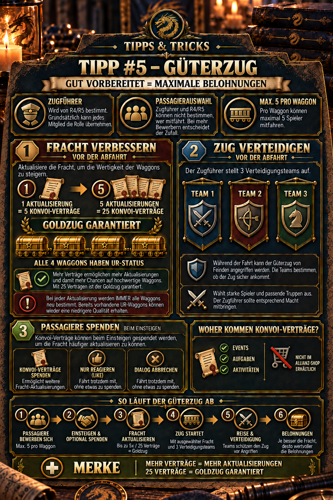

---
arten:
  - Anleitung
  - Strategie
themen:
  - Events
  - Allianz
---

# 💡 Tipp #5 – Güterzug

## Das Wichtigste in Kürze

- **Zugführer:** R4/R5 bestimmen ein Mitglied, das den Güterzug vorbereitet. Die Rolle ist nicht auf einen bestimmten Rang beschränkt.
- **Goldzug planen:** Eine Fracht-Aktualisierung kostet **5 Konvoi-Verträge**. Nach **5 Aktualisierungen** beziehungsweise **25 Verträgen** ist ein Goldzug mit vier UR-Waggons garantiert.
- **Nicht nur einzelne Waggons ändern sich:** Bei einer Aktualisierung wird die gesamte Fracht neu bestimmt. Auch ein bereits vorhandener UR-Waggon kann vorher wieder schlechter werden.
- **Verteidigung nicht vergessen:** Vor der Abfahrt stellt der Zugführer **3 Verteidigungsteams** auf.
- **Passagiere werden nicht ausgewählt:** Pro Waggon fahren höchstens **5 Mitglieder** mit. Bei zu vielen Bewerbern entscheidet das Spiel zufällig – weder Zugführer noch R4/R5 können eingreifen.
- **Verträge sammeln:** Konvoi-Verträge stammen aus Events, Aufgaben und Aktivitäten; im Allianz-Shop sind sie nicht erhältlich.

> **Merksatz:** Erst 25 Verträge sichern, dann fünfmal aktualisieren und vor der Abfahrt drei starke Verteidigungsteams aufstellen.



## Wofür ist dieser Tipp?

Dieser Tipp erklärt den gesamten Ablauf des Güterzugs: von der Ernennung des Zugführers über Bewerbungen und freiwillige Vertragsspenden bis zur Fracht-Aktualisierung und Verteidigung. Das Ziel ist, die knappen Konvoi-Verträge planbar einzusetzen, Missverständnisse bei der Passagierauswahl zu vermeiden und den Zug möglichst wertvoll und gut geschützt auf die Reise zu schicken.

Der Artikel ist besonders hilfreich für:

- **R4/R5**, die einen Zugführer einsetzen und die Abfahrt koordinieren,
- den **Zugführer**, der Fracht und Verteidigung vorbereitet,
- **Passagiere**, die sich bewerben und Konvoi-Verträge beisteuern können,
- sowie alle Mitglieder, die verstehen möchten, warum für einen garantierten Goldzug 25 Verträge benötigt werden.

## Rollen und Zuständigkeiten

| Rolle | Aufgabe | Kann diese Rolle entscheiden? |
| --- | --- | --- |
| **R4/R5** | Zugführer bestimmen und Ablauf innerhalb der Allianz koordinieren | wer Zugführer wird |
| **Zugführer** | Fracht aktualisieren und vor der Abfahrt drei Verteidigungsteams aufstellen | wie oft aktualisiert wird und welche Teams verteidigen |
| **Passagiere** | sich für einen Waggon bewerben und beim Einsteigen freiwillig Verträge spenden | ob sie Verträge beisteuern möchten |
| **Spielsystem** | Bewerber bei Überbelegung auswählen | wer bei zu vielen Bewerbern tatsächlich mitfährt |

Der wichtigste Unterschied: Der Zugführer verwaltet den Zug, kann aber **keine bevorzugten Passagiere auswählen**. Auch R4/R5 haben laut vorliegender Ingame-Dokumentation keinen Einfluss auf die Zufallsauswahl.

## 1. Zugführer bestimmen

R4 oder R5 ernennen den Zugführer. Grundsätzlich kann jedes Allianzmitglied diese Aufgabe übernehmen; der Rang des Mitglieds ist dafür nicht entscheidend.

Da der Zugführer die entscheidenden Vorbereitungen übernimmt, sollte die Allianz nach praktischen Kriterien auswählen:

- Ist das Mitglied vor der Abfahrt zuverlässig online?
- Kennt es das Ziel der Allianz – beispielsweise Goldzug oder sparsamer Vertragsverbrauch?
- Kann es drei geeignete Verteidigungsteams aufstellen?
- Ist abgestimmt, wie viele Konvoi-Verträge für den Zug beziehungsweise durch Passagierspenden verfügbar sind?

> **Praxisempfehlung:** Bestimmt nicht nur einen Namen, sondern sprecht vorher ab, ob sicher bis zum Goldzug aktualisiert werden soll. So wird nicht nach mehreren Aktualisierungen abgebrochen, weil die letzten Verträge fehlen.

## 2. Passagiere bewerben sich

Jeder der vier Waggons nimmt maximal **5 Passagiere** auf. Sind alle vier Waggons für Passagiere geöffnet, ergeben sich damit rechnerisch bis zu **20 Plätze**.

Gehen für einen Waggon mehr als fünf Bewerbungen ein, wählt das Spiel zufällig aus. Daraus folgen zwei wichtige Regeln:

- Eine Bewerbung garantiert bei Überbelegung keinen Platz.
- Zugführer und R4/R5 können einzelne Mitglieder weder bevorzugen noch ausschließen.

Die Auswahl sollte deshalb nicht als persönliche Entscheidung der Allianzleitung verstanden werden. Wer nicht mitgenommen wird, ist bei einem überbuchten Waggon durch die Spielmechanik ausgeschieden.

Nicht dokumentiert ist, ob Bewerbungszeitpunkt, VIP-Status oder andere Merkmale die aktuelle Auswahlwahrscheinlichkeit beeinflussen. Die bereitgestellte Ingame-Grafik beschreibt die Auswahl lediglich als zufällig.

## 3. Konvoi-Verträge beim Einsteigen spenden

Aus der bereitgestellten Ingame-Grafik geht hervor, dass ausgewählte Passagiere beim Einsteigen Konvoi-Verträge spenden können. Diese Spende unterstützt den Zugführer dabei, die Fracht häufiger zu aktualisieren.

Die Spende ist **freiwillig**:

- Wer Konvoi-Verträge spendet, fährt mit und erhöht den verfügbaren Vorrat.
- Wer nur reagiert beziehungsweise den Dialog ohne Spende schließt, fährt laut Ingame-Grafik ebenfalls mit.
- Die Spende ist damit keine Voraussetzung für die Mitfahrt und sollte nicht mit der zufälligen Bewerberauswahl verwechselt werden.

Für die Allianz ist eine vorherige Absprache trotzdem sinnvoll. Wenn mehrere ausgewählte Passagiere kleine Beiträge leisten, muss der Zugführer die für fünf Aktualisierungen nötigen 25 Verträge nicht allein bereitstellen.

## 4. Fracht aktualisieren

Eine Aktualisierung kostet **5 Konvoi-Verträge**. Nach fünf Aktualisierungen ist ein Goldzug garantiert; alle vier Waggons erhalten dann UR-Status.

| Anzahl Aktualisierungen | Insgesamt benötigte Verträge | Gesicherter Stand |
| ---: | ---: | --- |
| 1 | 5 | Fracht wird vollständig neu bestimmt |
| 2 | 10 | noch keine Goldzug-Garantie |
| 3 | 15 | noch keine Goldzug-Garantie |
| 4 | 20 | noch keine Goldzug-Garantie |
| 5 | 25 | **Goldzug garantiert: alle 4 Waggons UR** |

### Warum einzelne gute Waggons noch kein sicherer Fortschritt sind

Bei jeder Aktualisierung werden **alle Waggons neu bestimmt**. Die vorhandenen Qualitäten werden nicht einzeln festgeschrieben. Ein UR-Waggon aus einem früheren Ergebnis kann bei der nächsten Aktualisierung daher wieder eine niedrigere Qualität erhalten.

Das hat zwei Konsequenzen:

1. Eine Aktualisierung ist bis zur garantierten fünften Runde keine reine Verbesserung, sondern eine neue Auslosung der gesamten Fracht.
2. Wer gezielt einen Goldzug erreichen möchte, sollte die vollständigen **25 Verträge vor Beginn** einplanen. Sonst kann die Allianz nach einer Zwischenstufe mit schlechterer Fracht und ohne ausreichende Verträge für die Garantie dastehen.

Die Empfehlung, 25 Verträge vorab zu sichern, ist eine Strategieableitung aus den dokumentierten Kosten und der vollständigen Neuauslosung. Sie ist keine zusätzliche Spielregel.

## 5. Drei Verteidigungsteams aufstellen

Vor der Abfahrt stellt der Zugführer **3 Verteidigungsteams** auf. Der Güterzug kann während der Reise angegriffen beziehungsweise geplündert werden; schwache oder unvollständige Teams machen die zuvor investierten Verträge deshalb unnötig riskant.

Vor dem Start sollte der Zugführer bei allen drei Teams prüfen:

- Sind die stärksten sinnvoll verfügbaren Helden eingesetzt?
- Sind ausreichend Soldaten zugeordnet?
- Passen Helden, Truppentypen und vorhandene Formationsboni zusammen?
- Ist nicht versehentlich ein schwaches Alltags- oder Sammelteam ausgewählt?
- Sind alle drei Verteidigungsplätze tatsächlich belegt?

Die öffentlich auffindbaren Update-Hinweise zeigen, dass der Güterzug zuletzt um eine **Auswahl von Trupp-Boni während Plünderungsangriffen** ergänzt und mehrfach bei Oberfläche und Regeln überarbeitet wurde. Welche Boni aktuell verfügbar sind und wie sie exakt wirken, sollte deshalb direkt im Spiel geprüft werden.

## 6. Woher kommen Konvoi-Verträge?

Die bereitgestellte Ingame-Dokumentation nennt drei Quellen:

- **Events**
- **Aufgaben**
- **Aktivitäten**

Im **Allianz-Shop** sind Konvoi-Verträge nicht erhältlich. Die Allianz kann einen fehlenden Rest daher nicht einfach unmittelbar vor der Abfahrt mit Allianzmünzen ausgleichen.

Eine konkrete, dauerhaft gültige Liste aller Events und Aufgaben samt Mengen ist öffentlich nicht verlässlich dokumentiert. Da Belohnungen und Aktionszeiträume wechseln können, gilt die aktuelle Ingame-Belohnungsvorschau als maßgebliche Quelle.

### Sinnvolle Vorratsplanung

- Verträge nicht unkoordiniert ausgeben, wenn die Allianz einen Goldzug plant.
- Vor der Abfahrt prüfen, wie viele Verträge tatsächlich für den Zug verfügbar sind.
- Passagiere frühzeitig darauf hinweisen, dass sie beim Einsteigen freiwillig Verträge spenden können.
- Mit **25 tatsächlich verfügbaren Verträgen** planen, nicht nur mit angekündigten Spenden.

## Der vollständige Ablauf

1. **R4/R5 bestimmen den Zugführer.**
2. **Mitglieder bewerben sich** für die Waggons; pro Waggon stehen maximal fünf Plätze zur Verfügung.
3. **Das Spiel wählt bei Überbelegung zufällig aus.** Zugführer und R4/R5 können diese Auswahl nicht steuern.
4. **Ausgewählte Passagiere steigen ein** und können freiwillig Konvoi-Verträge spenden.
5. **Der Zugführer aktualisiert die Fracht.** Jede Aktualisierung kostet fünf Verträge und bestimmt alle Waggons neu.
6. **Nach fünf Aktualisierungen** beziehungsweise 25 Verträgen ist der Goldzug mit vier UR-Waggons garantiert.
7. **Der Zugführer richtet drei Verteidigungsteams ein.**
8. **Der Güterzug startet.** Während der Fahrt können Angriffe beziehungsweise Plünderungsversuche stattfinden.
9. **Nach Abschluss werden die Belohnungen verteilt.** Ihre Qualität hängt von der vorbereiteten Fracht und den aktuellen Spielregeln ab.

## Empfohlener Allianz-Ablauf für einen Goldzug

### Vor der Bewerbungsphase

- Zugführer und geplante Startzeit festlegen.
- Allianzweit ankündigen, dass 25 Konvoi-Verträge das gemeinsame Ziel sind.
- Klären, wer Verträge beisteuern kann.

### Vor der Fracht-Aktualisierung

- Tatsächlich vorhandene Verträge zählen.
- Nur mit sicher verfügbaren Spenden rechnen.
- Entscheiden, ob die Allianz fünf Aktualisierungen vollständig durchführen kann.

### Vor der Abfahrt

- Kontrollieren, ob alle vier Waggons nach der fünften Aktualisierung UR-Status zeigen.
- Drei Verteidigungsteams vollständig prüfen.
- Aktuelle Trupp-Boni oder Plünderungsregeln im Spiel kontrollieren.
- Erst danach starten.

## Typische Fehler

- **Mit zu wenigen Verträgen beginnen:** Nach mehreren Neuauslosungen fehlen die Mittel für die garantierte fünfte Aktualisierung.
- **UR-Waggons für gesperrt halten:** Bei der nächsten Aktualisierung wird die gesamte Fracht neu bestimmt; einzelne UR-Waggons bleiben nicht automatisch erhalten.
- **Passagiere manuell verteilen wollen:** Bei mehr als fünf Bewerbern pro Waggon entscheidet das Spiel zufällig.
- **Spende mit Mitfahrrecht verwechseln:** Laut Ingame-Grafik können ausgewählte Passagiere auch ohne Spende mitfahren.
- **Nur die Fracht optimieren:** Ein wertvoller Zug braucht trotzdem drei brauchbare Verteidigungsteams.
- **Verträge im Allianz-Shop suchen:** Dort sind sie nach dem dokumentierten Stand nicht erhältlich.
- **Mit angekündigten statt vorhandenen Spenden rechnen:** Wenn ein Beitrag ausbleibt, kann die Goldzug-Garantie verfehlt werden.

## Grenzen und noch zu prüfende Angaben

- Güterzug-Regeln und Oberfläche wurden im August und September 2026 mehrfach aktualisiert. Abweichende Ingame-Anzeigen haben deshalb Vorrang vor diesem Artikel.
- Öffentlich nicht belastbar dokumentiert sind die aktuellen Mengen und genauen Fundorte aller Konvoi-Verträge.
- Noch zu prüfen ist, ob sich Bewerbungszeitpunkt, VIP-Status oder andere Merkmale auf die Passagierauswahl auswirken. Die vorliegende Grafik nennt nur eine Zufallsauswahl.
- Nicht eindeutig dokumentiert ist, wie erfolgreiche oder abgewehrte Plünderungsangriffe die Belohnungen des Zugführers und der einzelnen Passagiere im aktuellen Regelstand verändern.
- Die genaue Wirkung der im August 2026 ergänzten Trupp-Boni während Plünderungsangriffen sollte direkt im aktuellen Auswahlbildschirm nachgelesen werden.
- Auch Startfenster, Wartezeiten, Bewerbungsdauer und mögliche tägliche Begrenzungen sind im vorliegenden Material nicht vollständig beschrieben.

## Quellen und Verlässlichkeit

- **DIE-Ingame-Beleg:** Rollenvergabe, Aktualisierungskosten, Goldzug-Garantie, vollständige Neuauslosung der Waggons, drei Verteidigungsteams, Passagiergrenze, zufällige Auswahl, freiwillige Spenden und Herkunft der Konvoi-Verträge stammen aus der bereitgestellten Allianz-Grafik und der freigegebenen Mitteilung.
- **Community-Dokumentation offizieller Updates:** [Z Route Academy – Updates](https://zroute.dev/updates/) fasst offizielle Ankündigungen zusammen. Dort sind für den 19. August 2026 Trupp-Boni bei Güterzug-Plünderungen, für den 26. August Regel- und Oberflächenanpassungen sowie für den 9. September eine weitere visuelle Überarbeitung dokumentiert.
- **Ergänzende Update-Zusammenfassung:** Ein [BlueStacks-Beitrag zum Update vom 19. August 2026](https://www.reddit.com/r/BlueStacks/comments/1vtdgxx/z_route_redemption_update_0819_is_live_with_elite/) nennt ebenfalls die Auswahl von Trupp-Boni bei Plünderungen sowie überarbeitete Hinweise zur Zugführer-Ernennung und Passagierdarstellung.

Eine öffentlich zugängliche, vollständige offizielle Anleitung mit allen aktuellen Güterzug-Regeln war bei der Recherche nicht auffindbar. Deshalb sind konkrete Ingame-Anzeigen für Kosten, Auswahl, Boni und Belohnungen die verlässlichste Quelle.

Stand der Recherche: **25.09.2026**.

## Allianz-Mitteilung zum Kopieren

```html
<size=38><color=#8DAA2D><b>💡 TIPP #5 – GÜTERZUG</b></color></size>

🚂 Der <b>Zugführer</b> wird von R4/R5 bestimmt. Grundsätzlich kann jedes Mitglied die Rolle übernehmen.

🎁 <b>Fracht verbessern:</b>
Jede Aktualisierung kostet <b>5 Konvoi-Verträge</b>. Nach <color=#8DAA2D><b>5 Aktualisierungen</b></color> ist ein Goldzug garantiert:
➡️ Alle 4 Waggons haben dann <color=#8DAA2D><b>UR-Status!</b></color>
➡️ Dafür werden insgesamt <b>25 Konvoi-Verträge</b> benötigt.

🛡️ Vor Abfahrt stellt der Zugführer <b>3 Verteidigungsteams</b> auf.

👥 Max. <b>5 Passagiere pro Waggon</b>. Bei mehr Bewerbern entscheidet der Zufall – Zugführer und R4/R5 können die Auswahl nicht bestimmen.

💡 Konvoi-Verträge gibt es durch Events, Aufgaben & Aktivitäten – <b>nicht im Allianz-Shop.</b>
```
