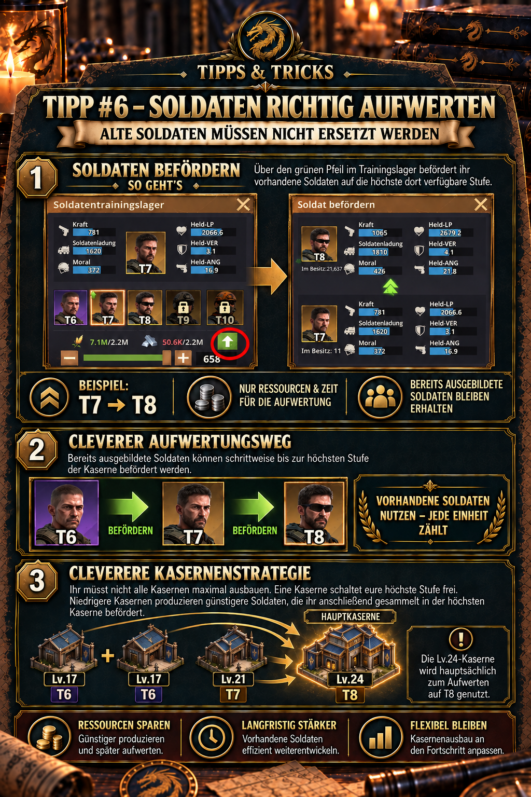

# 💡 Tipp #6 – Soldaten richtig aufwerten

## Das Wichtigste in Kürze

- **Alte Soldaten behalten:** Niedrigere Soldatenstufen müssen nicht entlassen oder vollständig neu ausgebildet werden.
- **Grünen Pfeil verwenden:** Im Trainingslager öffnet der grüne Aufwärtspfeil die Beförderung auf die höchste dort verfügbare Stufe.
- **Nur die Aufwertung bezahlen:** Für die Beförderung fallen die im Dialog angezeigten Ressourcen und die benötigte Aufwertungszeit an.
- **Eine Hauptkaserne reicht:** Ein hoch ausgebautes Trainingslager kann die höchste Stufe freischalten und vorhandene niedrigere Soldaten gesammelt befördern.
- **Andere Lager weiter nutzen:** Niedrigere Trainingslager können parallel ihre jeweils verfügbaren Soldaten produzieren, die später in der Hauptkaserne aufgewertet werden.

> **Merksatz:** Niedriger ausbilden, vorhandene Soldaten sammeln und in der höchsten Kaserne über den grünen Pfeil befördern.



## Wofür ist dieser Tipp?

Dieser Tipp zeigt, wie bereits ausgebildete Soldaten auf eine höhere freigeschaltete Stufe befördert werden. Dadurch bleiben früh produzierte Einheiten langfristig nutzbar und mehrere Trainingslager müssen nicht zwingend gleichzeitig auf dieselbe Gebäudestufe gebracht werden.

Der Tipp hilft insbesondere, wenn ihr:

- nach dem Freischalten einer neuen Soldatenstufe noch viele ältere Soldaten besitzt,
- eure Bauressourcen zunächst auf ein einziges Trainingslager konzentrieren möchtet,
- mehrere Trainingslager auf unterschiedlichen Ausbaustufen betreibt,
- niedrigere Stufen zunächst weiterproduzieren und später gesammelt befördern wollt,
- oder den grünen Pfeil im Trainingslager bisher übersehen habt.

## Ausbilden und Befördern sind zwei verschiedene Vorgänge

| Vorgang | Was passiert? | Typischer Zweck |
| --- | --- | --- |
| **Ausbilden** | Neue Soldaten der im Trainingslager verfügbaren Stufe werden produziert. | Truppenbestand vergrößern |
| **Befördern** | Bereits vorhandene Soldaten einer niedrigeren Stufe werden auf eine höhere verfügbare Stufe aufgewertet. | bestehenden Bestand stärker machen |

Beim Befördern werden also keine zusätzlichen Soldaten aus dem Nichts erzeugt. Ihr verbessert bereits ausgebildete Einheiten und bezahlt dafür die im Beförderungsdialog ausgewiesenen Ressourcen und die benötigte Zeit.

Das Beispiel aus der Ingame-Grafik lautet:

```text
T7 → T8
```

Entscheidend ist die höchste Soldatenstufe, die das verwendete Trainingslager aktuell bereitstellt. Ein Lager, das höchstens T7 freigeschaltet hat, kann keine Beförderung auf T8 durchführen.

## Soldaten über den grünen Pfeil befördern

Die mitgelieferten Ingame-Ausschnitte zeigen den praktischen Weg direkt in der Spieloberfläche:

1. Öffnet das **Trainingslager**, das eure gewünschte Zielstufe bereits freigeschaltet hat.
2. Wählt die vorhandene niedrigere Soldatenstufe aus, die ihr verbessern möchtet.
3. Tippt auf den **grünen Pfeil nach oben**.
4. Prüft im Beförderungsdialog Ausgangsstufe und Zielstufe – beispielsweise T7 und T8.
5. Legt die gewünschte Anzahl fest.
6. Kontrolliert Ressourcenbedarf und Dauer.
7. Startet die Beförderung erst, wenn Zielstufe, Menge und Kosten stimmen.

> **Wichtig:** Verwendet für die Umsetzung den echten Ingame-Ausschnitt in der Tippgrafik. Symbolposition, Farben oder Beschriftungen können sich nach Oberflächenupdates verändern; der grüne Aufwärtspfeil ist der entscheidende Einstieg in die Beförderung.

## Was bei der Beförderung erhalten bleibt

Der Vorteil besteht darin, dass der vorhandene Soldatenbestand nicht verworfen wird. Aus den ausgewählten niedrigeren Soldaten werden Soldaten der höheren Zielstufe.

Damit bleiben eure früheren Investitionen praktisch nutzbar:

- Die Einheiten müssen nicht entlassen werden.
- Ihr müsst nicht dieselbe Anzahl zusätzlich von Grund auf neu ausbilden.
- Niedrigere Soldaten können schrittweise an den aktuellen Entwicklungsstand angepasst werden.
- Ein gewachsener Altbestand lässt sich in planbaren Blöcken modernisieren.

Die Beförderung ist trotzdem **nicht kostenlos**. Das Spiel verlangt Ressourcen und Zeit für die Aufwertung. Welche Mengen genau benötigt werden, hängt von Ausgangsstufe, Zielstufe, Anzahl und dem aktuellen Spielstand ab und muss im Beförderungsdialog geprüft werden.

## Die clevere Kasernenstrategie

Die Grundidee lautet: Nicht jedes Trainingslager muss sofort maximal ausgebaut werden.

- Ein **Haupttrainingslager** wird bevorzugt ausgebaut und schaltet eure höchste verfügbare Soldatenstufe frei.
- Niedrigere Trainingslager bleiben produktiv und bilden weiterhin Soldaten ihrer verfügbaren Stufen aus.
- Diese niedrigeren Soldaten werden später im Haupttrainingslager gesammelt auf die höchste Stufe befördert.

Dadurch konzentriert ihr Gebäudeausbau, Bauzeit und Bauressourcen zunächst auf das Lager, das für den nächsten Stufenfortschritt entscheidend ist. Die übrigen Lager bleiben währenddessen verwendbar, obwohl sie beim Gebäudestufenfortschritt zurückliegen.

### Beispiel aus der Allianz-Grafik

| Anzahl | Stufe des Trainingslagers | Dort verfügbare Soldaten | Aufgabe im System |
| ---: | ---: | ---: | --- |
| 1× | Lv.24 | T8 | Hauptkaserne: höchste Stufe freischalten und vorhandene Soldaten auf T8 befördern |
| 1× | Lv.21 | T7 | weiterhin T7 produzieren und später auf T8 befördern |
| 2× | Lv.17 | T6 | weiterhin T6 produzieren und später gesammelt weiterentwickeln |

Die Lv.24-Kaserne dient in diesem Beispiel hauptsächlich als **Beförderungszentrum für T8**. Die drei niedrigeren Lager liefern fortlaufend Soldaten, ohne dass zuvor alle vier Gebäude auf Lv.24 gebracht werden müssen.

Dieses Beispiel beschreibt eine mögliche Aufbauphase. Sobald weitere Stufen freigeschaltet werden, verschiebt sich die Rolle der Hauptkaserne entsprechend.

## Was „günstigere Soldaten produzieren“ genau bedeutet

Niedrigere Trainingslager können ihre aktuell verfügbaren Soldaten zunächst mit geringerem direktem Ressourcenbedarf produzieren. Anschließend entstehen jedoch zusätzliche Beförderungskosten und eine weitere Wartezeit.

Deshalb müssen zwei Aussagen getrennt werden:

- **Belegt:** Ihr könnt niedrigere Soldaten weiterproduzieren und später nur die Aufwertung bezahlen, statt vorhandene Einheiten zu ersetzen.
- **Nicht allgemein belegt:** Dass Ausbildung plus spätere Beförderung in der Gesamtsumme immer weniger Ressourcen oder Zeit kostet als eine direkte Ausbildung auf der höchsten Stufe.

Der wichtigste Vorteil dieser Strategie ist daher die **Flexibilität im Gebäudeausbau und die Weiterverwendung vorhandener Soldaten**. Ob sie in einer konkreten Situation auch insgesamt günstiger ist, lässt sich nur durch einen Vergleich der aktuellen Ingame-Kosten und Zeiten feststellen.

## Wann die Strategie besonders sinnvoll ist

### Nach dem Freischalten einer neuen Stufe

Wenn eure Hauptkaserne gerade T8 freigeschaltet hat, bleibt ein großer T6- oder T7-Bestand sonst kampfschwächer. Durch die Beförderung könnt ihr diesen Altbestand schrittweise auf den neuen Standard bringen.

### Wenn Bauressourcen knapp sind

Statt vier Trainingslager gleichzeitig hochzuziehen, könnt ihr zunächst ein Lager priorisieren. Das passt zur allgemeinen Ausbauempfehlung, nur die für den nächsten Fortschritt wichtigen Gebäude aktuell zu halten und Ressourcen nicht gleichmäßig über alle Gebäude zu verteilen.

### Wenn alle Trainingslager beschäftigt bleiben sollen

Die niedrigeren Lager können weiter Einheiten produzieren, während ein Lager den technologischen Fortschritt vorgibt. Achtet jedoch darauf, ob eine laufende Beförderung die normale Ausbildungswarteschlange der Hauptkaserne belegt; dieses Verhalten sollte mit der aktuellen Ingame-Anzeige geprüft werden.

### Wenn viele niedrige Soldaten vorhanden sind

Je größer der Altbestand, desto wichtiger wird eine geordnete Beförderung. Arbeitet in sinnvollen Blöcken und kontrolliert nach jedem Auftrag, welche Stufen und Mengen noch vorhanden sind.

## Ausbaupriorität und Soldatenstufen

Die Z Route Academy empfiehlt, ein Soldatentrainingslager nach Möglichkeit laufend zu verbessern, weil höhere Soldatenstufen zu den größten direkten Kraftzuwächsen eines Teams gehören. Als Basisstufen für die Freischaltungen nennt die Community-Dokumentation:

| Soldatenstufe | genannte Basisstufe |
| ---: | ---: |
| T7 | 20 |
| T8 | 24 |
| T9 | 27 |
| T10 | 30 |

Diese Tabelle beschreibt **Basisstufen** aus der externen Community-Quelle. Das Allianzbeispiel mit Lv.17, Lv.21 und Lv.24 beschreibt dagegen die Stufen der verwendeten Trainingslager. Beide Angaben dürfen nicht automatisch gleichgesetzt werden; prüft die tatsächlichen Gebäudevoraussetzungen immer direkt im Spiel.

## Eine sinnvolle Beförderungsreihenfolge

Wenn nicht genügend Ressourcen für alle Alttruppen vorhanden sind, hilft eine klare Priorität:

1. **Zielstufe freischalten:** Erst muss das Haupttrainingslager die gewünschte Stufe bereitstellen.
2. **Aktive Kampfteams versorgen:** Befördert zuerst Soldaten, die eure regelmäßig eingesetzten Teams tatsächlich benötigen.
3. **Kleine Restbestände vermeiden:** Fasst Beförderungen zu übersichtlichen Blöcken zusammen, sofern Zeit und Ressourcen passen.
4. **Ressourcenreserve behalten:** Verbraucht nicht automatisch alles, wenn parallel wichtige Bau- oder Forschungsprojekte anstehen.
5. **Altbestand nachziehen:** Befördert die verbleibenden niedrigeren Stufen schrittweise, bis der gewünschte Standard erreicht ist.

Welche Soldaten einem konkreten Team zugeordnet werden und ob das Spiel bei der Aufstellung automatisch höhere Stufen bevorzugt, ist im bereitgestellten Material nicht dokumentiert. Kontrolliert deshalb die tatsächliche Teamzusammensetzung vor wichtigen Kämpfen.

## Vor dem Start kontrollieren

- Befindet ihr euch im Trainingslager mit der richtigen höchsten Stufe?
- Ist wirklich **Befördern** und nicht normale Ausbildung ausgewählt?
- Stimmen Ausgangs- und Zielstufe?
- Ist die gewünschte Anzahl korrekt?
- Bleiben genügend Ressourcen für geplante Gebäude und Forschung übrig?
- Passt die Dauer zu eurer Online- oder Offline-Zeit?
- Werden gerade Trainings- oder Beförderungsboni angezeigt, die ihr nutzen möchtet?

## Typische Fehler

- **Niedrigere Soldaten entlassen:** Sie können über die Beförderung weiterhin einen Wert haben.
- **Den grünen Pfeil übersehen:** Dann wird nur die normale Ausbildungsansicht genutzt.
- **Das falsche Trainingslager öffnen:** Nur ein ausreichend ausgebautes Lager kann die gewünschte Zielstufe anbieten.
- **Alle Kasernen gleichzeitig maximieren:** Das bindet Bauzeit und Ressourcen, obwohl zunächst ein Hauptlager die höchste Stufe freischalten kann.
- **Gesamtersparnis voraussetzen:** Niedrige Ausbildung plus spätere Beförderung ist nicht nachweislich in jeder Situation billiger als direkte Ausbildung.
- **Kosten ungeprüft bestätigen:** Große Beförderungsblöcke können erhebliche Ressourcen und Zeit benötigen.
- **Nur neue T8 ausbilden:** Ein großer vorhandener T6-/T7-Bestand bleibt dadurch unnötig schwach, obwohl er befördert werden könnte.
- **Beförderungswarteschlange vergessen:** Prüft, ob und wie lange das Hauptlager dadurch für andere Aufträge belegt wird.

## Grenzen und noch zu prüfende Angaben

- Exakte Ressourcen- und Zeitkosten je Soldatenstufe sind im bereitgestellten Material nicht vollständig dokumentiert und können durch Boni oder Updates abweichen.
- Noch zu prüfen ist, ob Beförderungen dieselben Geschwindigkeitsboni, Amtsboni und Allianzhilfen wie eine normale Ausbildung erhalten.
- Nicht belegt ist, ob Ausbildung einer niedrigen Stufe plus Beförderung insgesamt günstiger oder schneller als die direkte Ausbildung der Zielstufe ist.
- Die Belegung von Ausbildungs- und Beförderungswarteschlangen sollte im aktuellen Trainingslager geprüft werden.
- Im Mai 2026 wurden innerstädtische Trainings- und Forschungsgebäude laut Updateübersicht organisatorisch zusammengeführt. Namen und Positionen älterer Screenshots können daher von der aktuellen Oberfläche abweichen.
- Serverstand, Spielfortschritt und spätere Updates können Freischaltbedingungen verändern. Die aktuelle Gebäudeansicht hat Vorrang.

## Quellen und Verlässlichkeit

- **DIE-Ingame-Beleg:** Der grüne Beförderungspfeil, das Beispiel T7 → T8, die Zahlung von Ressourcen und Zeit für die Aufwertung sowie die Beispielstruktur mit Trainingslagern auf Lv.24, Lv.21 und Lv.17 stammen aus der bereitgestellten Allianz-Grafik und der freigegebenen Mitteilung.
- **Community-Quelle:** [Z Route Academy – Squad Leveling & Composition](https://zroute.dev/getting-started/squad-leveling-composition/) bezeichnet höhere Soldatenstufen als einen der größten direkten Kraftzuwächse, empfiehlt ein priorisiertes Soldatentrainingslager und nennt die Basisstufen für T7 bis T10.
- **Ergänzende Ausbauquelle:** [Z Route Academy – City & Base Rush Guide](https://zroute.dev/city/base-hq-progression/) empfiehlt, für effizienten Fortschritt gezielt die blockierenden Pflichtgebäude auszubauen, statt alle Gebäude gleichmäßig anzuheben.
- **Änderungshistorie:** Die [Z Route Academy – Updates](https://zroute.dev/updates/) dokumentiert für den 13. Mai 2026 eine Neuorganisation innerstädtischer Trainings- und Forschungsgebäude bei unveränderten Werten.

Eine öffentlich zugängliche offizielle Tabelle mit vollständigen Beförderungskosten, Zeiten und Bonusregeln war bei der Recherche nicht auffindbar. Verbindlich sind deshalb die Werte im aktuellen Beförderungsdialog.

Stand der Recherche: **25.09.2026**.

## Allianz-Mitteilung zum Kopieren

```html
<size=38><color=#8DAA2D><b>💡 TIPP #6 – SOLDATEN RICHTIG AUFWERTEN</b></color></size>

Alte Soldaten müssen nicht ersetzt werden! Über den <color=#8DAA2D><b>grünen Pfeil</b></color> im Trainingslager könnt ihr sie auf die höchste dort verfügbare Stufe befördern.

➡️ Beispiel: T7 → T8
Dabei zahlt ihr nur die Ressourcen & Zeit für die Aufwertung.

💡 <b>Das ermöglicht eine clevere Kasernenstrategie:</b>
Ihr müsst nicht alle Kasernen maximal ausbauen. Eine Kaserne kann eure höchste Stufe freischalten, während niedrigere Kasernen weiterhin günstigere Soldaten produzieren.

Diese könnt ihr anschließend in der höchsten Kaserne gesammelt befördern.

<b>Beispiel:</b>
🏰 1× Lv.24 → T8
🏰 1× Lv.21 → T7
🏰 2× Lv.17 → T6

➡️ Die Lv.24-Kaserne wird hauptsächlich zum <color=#8DAA2D><b>Aufwerten auf T8</b></color> genutzt.
```
