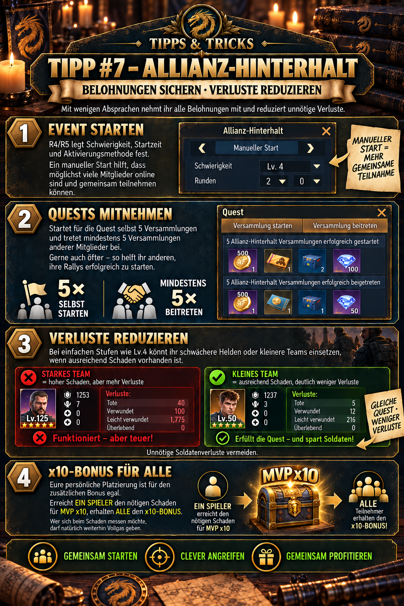

# 💡 Tipp #7 – Allianz-Hinterhalt

## Das Wichtigste in Kürze

- **Beide Quests erfüllen:** Startet selbst **5 Versammlungen** und tretet **mindestens 5 Versammlungen** anderer Mitglieder bei.
- **Nach fünf Beitritten weiterhelfen:** Zusätzliche Teilnahmen bringen die eigene Quest zwar nicht weiter, helfen aber anderen beim Füllen und Starten ihrer Rallys.
- **Verluste anpassen:** Auf einfachen Stufen wie Lv.4 können kleinere Teams oder schwächere Helden reichen, wenn der gemeinsame Schaden sicher ausreicht.
- **x10 ist ein Gemeinschaftsziel:** Erreicht ein Teilnehmer den nötigen Schaden für MVP x10, erhalten alle Teilnehmer den dazugehörigen Bonus; die persönliche Platzierung ist dafür unerheblich.
- **Schaden maximieren:** Startet eigene Rallys mit einem schwächeren Team und lasst euer stärkstes Team möglichst oft den Rallys anderer Mitglieder beitreten.
- **Nicht blind schwächen:** Bei höheren Schwierigkeiten oder knapper Schadensreserve haben erfolgreiche Rallys Vorrang vor möglichst kleinen Teams.

> **Merksatz:** Fünf Rallys starten, fünf Rallys beitreten, danach weiter unterstützen und nur so viel Kampfkraft einsetzen, wie für einen sicheren Erfolg nötig ist.



## Wofür ist dieser Tipp?

Dieser Tipp zeigt, wie die Allianz den Hinterhalt als gemeinsames Ereignis organisiert: möglichst viele persönliche Questbelohnungen abholen, Rallys zuverlässig füllen, unnötige Soldatenverluste begrenzen und gemeinsam den zusätzlichen x10-Bonus erreichen.

Dabei müssen drei Ziele gleichzeitig beachtet werden:

1. **Persönliche Quests:** Jedes Mitglied braucht eigene Starts und Beitritte.
2. **Allianzerfolg:** Rallys müssen gefüllt werden und rechtzeitig Schaden verursachen.
3. **Verlustkontrolle:** Auf leichten Stufen sollte nicht mehr Kampfkraft als nötig eingesetzt werden.

Die beste Strategie ist daher weder „alle immer mit maximaler Stärke“ noch „alle immer mit Minimalteams“. Entscheidend sind Schwierigkeit, verbleibende Zeit, Online-Aktivität und der bereits erreichte Gesamtschaden.

## 1. Das Event vorbereiten

R4/R5 legen laut bereitgestellter Ingame-Grafik folgende Punkte fest:

- **Schwierigkeit**
- **Startzeit**
- **Aktivierungsmethode**

Ein manueller Start ist sinnvoll, wenn möglichst viele Mitglieder gleichzeitig teilnehmen sollen. So kann die Allianz den Zeitpunkt ankündigen, Online-Spieler sammeln und die ersten Rallys schnell füllen.

Die Update-Historie zeigt, dass am 27. Mai 2026 zusätzlich ein automatischer Start und eigene Eventquests eingeführt wurden. Automatik kann organisatorisch bequem sein, ersetzt aber keine abgestimmte Startzeit, wenn viele Mitglieder aktiv mitspielen sollen.

### Empfohlene Ankündigung vor dem Start

- genaue Startzeit mit Serverzeit nennen,
- geplante Schwierigkeit ankündigen,
- Mitglieder an die **5 Starts + 5 Beitritte** erinnern,
- erklären, ob auf der gewählten Stufe kleine Teams erlaubt oder starke Teams benötigt werden,
- festlegen, wer für den x10-Schaden mit voller Stärke spielt,
- und darauf hinweisen, Rallys nicht unnötig leer stehen zu lassen.

## 2. Die beiden persönlichen Versammlungsquests

Für die Questbelohnungen sind zwei getrennte Aufgaben zu erfüllen:

| Quest | Persönliches Ziel | Was zählt? |
| --- | ---: | --- |
| **Versammlung starten** | 5× | selbst Rallyführer sein und eine Hinterhalt-Versammlung erfolgreich starten |
| **Versammlung beitreten** | mindestens 5× | einer Versammlung eines anderen Mitglieds erfolgreich beitreten |

Ein eigener Start ersetzt keinen Beitritt und ein Beitritt ersetzt keinen eigenen Start. Plant deshalb beide Zähler bewusst ein und kontrolliert den Fortschritt direkt im Questfenster.

> **Wichtig:** Die Formulierung in der bereitgestellten Grafik lautet „erfolgreich gestartet“ beziehungsweise „erfolgreich beigetreten“. Eine nur erstellte, aber nicht ausgelöste oder abgebrochene Rally kann deshalb möglicherweise nicht zählen. Maßgeblich ist, ob der Questzähler tatsächlich steigt.

## Erst beitreten oder erst selbst starten?

Hier treffen persönliche Quest und Gruppentaktik aufeinander:

- Für die eigene Quest benötigt ihr fünf eigene Starts.
- Für den Allianzerfolg sollten vorhandene Rallys trotzdem möglichst schnell gefüllt werden.
- Community-Empfehlungen priorisieren besonders Rallys von R4/R5, weil diese einen Schadensbonus für die Teilnehmer geben sollen.

Ein praktikabler Ablauf ist:

1. Offene, wichtige oder fast volle Rallys zuerst unterstützen.
2. Eigene Rally starten, sobald genügend weitere Mitglieder zum Beitritt bereitstehen.
3. Zwischen eigenen Starts wieder anderen Rallys beitreten.
4. Nach Erreichen der eigenen fünf Beitritte weiterhin freie Plätze füllen.
5. Die fünf eigenen Starts nicht bis in die letzten Minuten verschieben.

Damit werden nicht viele halbleere Rallys gleichzeitig eröffnet, während bereits laufende Versammlungen auf Teilnehmer warten.

## Warum mehr als fünf Beitritte sinnvoll sind

Nach dem fünften Beitritt ist die persönliche Beitrittsquest erfüllt. Das Event bleibt jedoch eine Allianzaufgabe:

- Andere Mitglieder benötigen weiterhin erfolgreiche eigene Starts.
- Schnell gefüllte Rallys starten früher.
- Mehr erfolgreiche Angriffe erhöhen den gemeinsamen Gesamtschaden.
- Leere Plätze in Bonus-Rallys verschenken mögliche Kampfkraft.

Wer online ist, sollte daher nicht sofort aufhören, sobald beide persönlichen Zähler abgeschlossen sind.

## 3. Rally-Timing richtig einschätzen

Die Community-Dokumentation nennt ein **dreiminütiges Vorbereitungsfenster** für Rallys. Zusätzlich kommt die Marschzeit bis zum Ziel hinzu.

Für einen erfolgreichen letzten Angriff muss daher gelten:

```text
verbleibende Eventzeit > Rally-Vorbereitung + Marschzeit
```

Beispiel: Benötigt eure Rally drei Minuten Vorbereitung und anschließend 40 Sekunden Marschzeit, muss sie deutlich mehr als 3:40 Minuten vor Eventende angelegt beziehungsweise ausgelöst werden. Ein Treffer nach Ablauf des Events verursacht laut Community-Quelle keinen Schaden.

### Konsequenzen für die Schlussphase

- Wartet nicht bis kurz vor Schluss mit den fünf eigenen Starts.
- Berücksichtigt die Rückkehrzeit einer bereits eingesetzten Truppe.
- Zieht bei langen Wegen näher an das Ziel, sofern die Spielregeln und Allianzplanung das zulassen.
- Wenn keine Bonusrally mehr rechtzeitig verfügbar wird, können einzelne eigene Rallys in der Schlussphase zusätzliche Treffer ermöglichen.

Das genaue Rallyfenster sollte im aktuellen Eventbildschirm kontrolliert werden, da Eventregeln durch Updates verändert werden können.

## 4. Schaden des Hauptteams maximieren

Wer möglichst viel Gesamtschaden verursachen möchte, sollte das stärkste Team **nicht dauerhaft als Leiter der eigenen Versammlung binden**. Eine selbst gestartete Rally wartet fest drei Minuten auf den Abmarsch. Während dieser Zeit steht das eingesetzte Team nicht für mehrere andere Angriffe zur Verfügung.

Die effizientere Rollenverteilung lautet deshalb:

- Das **schwächste noch ausreichend kampffähige Team** startet die eigenen Versammlungen.
- Das **stärkste Hauptteam** tritt nacheinander möglichst vielen Versammlungen anderer Mitglieder bei.
- Nach der Rückkehr wird das Hauptteam sofort in die nächste passende Rally geschickt.

So erfüllt ihr mit dem schwächeren Team weiterhin die Quest „5 Versammlungen starten“, während euer stärkstes Team einen deutlich größeren Anteil der tatsächlichen Kämpfe bestreiten kann.

### Warum das mehr Angriffe ermöglicht

Eine eigene Rally benötigt unabhängig von der Marschstrecke zunächst **3 Minuten Vorbereitungszeit**. In einem 30-minütigen Event sind deshalb praktisch höchstens ungefähr **9 eigene Sammelangriffe** möglich. Der exakte Wert hängt davon ab, wie schnell die erste Rally angelegt wird, wie lange Hin- und Rückmarsch dauern und ob zwischen den Starts Verzögerungen entstehen.

Beim Beitritt zu fremden Rallys muss euer Hauptteam dagegen nicht jedes Mal eine neue persönliche Dreiminutenfrist vollständig abwarten. Sind viele Mitglieder aktiv und öffnen ihre Rallys zeitlich versetzt, kann dasselbe starke Team nach seiner Rückkehr mehrmals pro Minute erneut eingesetzt werden.

Unter guten Bedingungen sind während der 30 Minuten realistisch ungefähr **25 Angriffe mit dem Hauptteam** möglich. Das ist ein Praxisrichtwert und keine garantierte Obergrenze.

| Einsatz des Hauptteams | Typische Begrenzung | Praxiswert über 30 Minuten |
| --- | --- | ---: |
| Eigene Rallys starten | jeweils 3 Minuten Vorbereitung plus Marsch und Rückkehr | höchstens ungefähr 9 Angriffe |
| Fremden Rallys beitreten | verfügbare Rallys sowie Marsch- und Rückkehrzeit | bei guter Aktivität ungefähr 25 Angriffe |

### Voraussetzungen für diese Strategie

- Genügend Mitglieder müssen gleichzeitig Rallys eröffnen.
- Die Starts sollten zeitlich versetzt sein, damit das Hauptteam nach der Rückkehr direkt weitergeschickt werden kann.
- Marschwege sollten möglichst kurz sein.
- Offene Rallys müssen schnell gefüllt werden.
- Das schwächere Startteam muss weiterhin stark genug sein, damit die eigene Rally erfolgreich bleibt.
- Das Hauptteam darf nicht in einer langsam gefüllten oder zu spät eintreffenden Rally festhängen.

### Praktischer Ablauf

1. Startet mit einem schwächeren Team eine eigene Rally.
2. Schickt euer Hauptteam gleichzeitig in eine bereits geöffnete Rally eines anderen Mitglieds.
3. Beobachtet die Rückkehr des Hauptteams und die Abmarschzeiten weiterer Rallys.
4. Tretet nach jeder Rückkehr sofort der nächsten Rally bei, die noch einen freien Platz hat und rechtzeitig startet.
5. Startet die nächste eigene Rally erneut mit dem schwächeren Team, sobald dessen Ablauf und Rückkehr es erlauben.
6. Achtet darauf, insgesamt mindestens fünf erfolgreiche eigene Starts und fünf erfolgreiche Beitritte für die Quests zu erreichen.

> **Schadensregel:** Das schwächere Team übernimmt die langsamen eigenen Starts; das stärkste Team bleibt beweglich und sammelt über viele fremde Rallys möglichst viele Treffer.

Diese Vorgehensweise maximiert nicht automatisch den Schaden jeder einzelnen Rally. Sie maximiert die Zahl der Einsätze eures stärksten Teams und damit häufig dessen Gesamtschaden über die komplette Eventdauer.

## 5. Verluste bei einfachen Stufen reduzieren

Bei einer einfachen Schwierigkeit wie **Lv.4** kann die Allianz häufig genügend Gesamtschaden erreichen, ohne dass jedes Mitglied sein stärkstes Team vollständig einsetzt. Dann können schwächere Helden, weniger Soldaten oder kleinere Formationen unnötige Verluste verringern.

Das Prinzip lautet:

```text
so wenig Truppen wie möglich – aber so viel Kampfkraft wie für sichere Rallys nötig
```

Die bereitgestellte Grafik zeigt dazu ein Vergleichsbeispiel:

| Beispielteam | Ergebnis laut Grafik | Aussage |
| --- | ---: | --- |
| starkes Team, Lv.125 | 40 Tote, 100 Verwundete, 1.775 leicht Verwundete | hoher Schaden, aber deutlich höhere Verluste |
| kleines Team, Lv.50 | 5 Tote, 12 Verwundete, 216 leicht Verwundete | Quest erfüllt, erheblich geringere Verluste |

Diese Zahlen sind **kein allgemeingültiger Verlustrechner**. Sie illustrieren nur das Prinzip der bereitgestellten Grafik; reale Verluste hängen unter anderem von Schwierigkeit, Helden, Soldatenzahl, Boni und Kampfverlauf ab.

## Wann kleine Teams sinnvoll sind

Kleinere Teams eignen sich, wenn:

- die Allianz die aktuelle Stufe zuverlässig besiegt,
- bereits ausreichend starke Spieler den nötigen Schaden liefern,
- eure Teilnahme vor allem für Questfortschritt und Rally-Unterstützung benötigt wird,
- und die kleinere Formation die Rally nicht scheitern lässt.

## Wann ihr nicht reduzieren solltet

Nutzt stärkere Teams, wenn:

- die Schwierigkeit neu oder knapp gewählt ist,
- Rallys regelmäßig scheitern,
- der x10-Schaden noch nicht gesichert ist,
- nur wenige Mitglieder online sind,
- das Event bald endet und jeder Treffer zählt,
- oder R4/R5 ausdrücklich volle Kampfkraft anfordern.

> **Entscheidungsregel:** Erst den gemeinsamen Erfolg sichern, danach Verluste optimieren.

Seit dem Update vom 3. Juni 2026 muss laut Updateübersicht mindestens ein Soldat je eingesetztem Helden mitgeführt werden. „Kleines Team“ bedeutet daher nicht automatisch eine Formation ohne Soldaten.

## 6. Den x10-Bonus gemeinsam freischalten

Für den zusätzlichen Bonus ist die persönliche Ranglistenposition laut freigegebener Allianz-Mitteilung nicht entscheidend. Es genügt, wenn **ein Teilnehmer** den erforderlichen Schaden für **MVP x10** erreicht; anschließend erhalten **alle Teilnehmer** den zugehörigen x10-Bonus.

Das ermöglicht eine klare Arbeitsteilung:

- Ein oder mehrere starke Spieler konzentrieren sich auf den erforderlichen Spitzenschaden.
- Andere Mitglieder erfüllen ihre 5+5-Quests und unterstützen Rallys mit angepassten Teams.
- Sobald der Bonus sicher erreicht ist, kann die Allianz Verluste stärker reduzieren.

### Was „x10“ nicht automatisch bedeutet

Die Bezeichnung **MVP x10** benennt das zu erreichende Bonusziel. Sie sollte nicht ohne Ingame-Beleg als „alle Grundbelohnungen werden verzehnfacht“ interpretiert werden. Die bereitgestellte Grafik spricht beim gemeinsamen Ergebnis von zusätzlichen beziehungsweise doppelten Belohnungen. Verbindlich ist die konkrete Belohnungsanzeige des aktuellen Events.

Wer sich gern im Schaden messen oder eine persönliche Platzierung erreichen möchte, kann weiterhin mit voller Stärke spielen. Für die gemeinsame Freischaltung ist dieser Wettbewerb aber nicht bei jedem Mitglied notwendig.

## Ergänzende Community-Tipps für mehr Schaden

Die folgenden Hinweise stammen aus einer Community-Anleitung und sind nicht so stark belegt wie die 5+5-Quests aus dem vorliegenden Ingame-Material:

### R4/R5-Rallys zuerst füllen

Rallys, die von R4 oder R5 eröffnet werden, sollen den Teilnehmern einen Schadensbonus geben. Sind dort Plätze frei, sollten sie vor gewöhnlichen Rallys gefüllt werden.

### Vorher eine Stadt erkunden

Das Erkunden einer Stadt vor Eventbeginn soll einen kleinen Schadensbonus für den gesamten Hinterhalt auslösen. Die Community-Quelle nennt **+1 %**, weist aber selbst darauf hin, dass dieser Wert nicht direkt anhand einer Ingame-Anzeige verifiziert wurde.

### Zara für die Wertung verwenden

Zara soll die im Allianz-Hinterhalt erzielte Wertung erhöhen; als relevante Fähigkeit nennt die Community-Anleitung „Roar“. Auch dieser Hinweis stammt aus Spielererfahrung und sollte anhand der aktuellen Helden- und Eventbeschreibung geprüft werden.

Diese Ergänzungen können den Schaden verbessern, sind aber kein Ersatz für gefüllte Rallys, rechtzeitige Starts und ausreichend starke Teams.

## Empfohlener Ablauf für die Allianz

### Vor dem Event

1. R4/R5 bestimmen Schwierigkeit, Startzeit und Aktivierungsmethode.
2. Startzeit und Teamstrategie im Allianzchat ankündigen.
3. Starke Spieler für das gemeinsame x10-Ziel einplanen.
4. Alle Mitglieder an die zwei getrennten 5er-Quests erinnern.
5. Optional Community-Tipps wie Erkundung, Zara und R4/R5-Bonusrallys prüfen.

### Während des Events

1. Wichtige offene Rallys füllen.
2. Eigene Versammlungen mit einem schwächeren, aber ausreichend starken Team rechtzeitig starten.
3. Das stärkste Team nach jeder Rückkehr möglichst direkt einer weiteren fremden Rally anschließen.
4. Questzähler nach jedem erfolgreichen Angriff kontrollieren.
5. Teamgröße nur reduzieren, wenn der Gesamtschaden sicher ausreicht.
6. Nach den ersten fünf Beitritten weiter Rallys unterstützen.
7. x10-Fortschritt beobachten und bei Bedarf starke Teams nachlegen.

### In der Schlussphase

1. Verbleibende Zeit mit Rally-Vorbereitung und Marschzeit vergleichen.
2. Fehlende persönliche Starts nicht zu spät beginnen.
3. Nur Rallys eröffnen oder betreten, die noch rechtzeitig treffen können.
4. Bei knappem Gesamtschaden auf stärkere Teams wechseln.

## Typische Fehler

- **Nur fünf eigene Rallys starten:** Die fünf Beitritte sind eine separate Quest.
- **Nach 5+5 sofort aufhören:** Andere Mitglieder brauchen weiterhin Teilnehmer für ihre eigenen Starts.
- **Zu viele Rallys gleichzeitig eröffnen:** Dadurch bleiben mehrere Versammlungen halb leer und starten verspätet.
- **Das Hauptteam mit eigenen Starts blockieren:** Durch die feste dreiminütige Vorbereitung erzielt es meist deutlich weniger Angriffe als beim wiederholten Beitritt zu fremden Rallys.
- **Kleine Teams auf einer zu schweren Stufe einsetzen:** Verlustreduktion hilft nicht, wenn Rallys scheitern oder der Bonus verfehlt wird.
- **Immer Vollgas geben:** Auf einfachen Stufen können übergroße Teams unnötige Soldatenverluste verursachen.
- **x10 als zehnfache Gesamtbelohnung lesen:** Die genaue Wirkung muss im aktuellen Belohnungsfenster geprüft werden.
- **Die Vorbereitungszeit vergessen:** Eine spät gestartete Rally kann das Ziel erst nach Eventende erreichen.
- **Persönliche Rangliste mit dem Gemeinschaftsbonus verwechseln:** Für dessen Freischaltung reicht laut Allianz-Mitteilung ein Spieler mit dem nötigen MVP-x10-Schaden.

## Grenzen und noch zu prüfende Angaben

- Die vollständige Schadensformel, alle Schwierigkeitsstufen und die genaue Belohnungsstaffel sind öffentlich nicht verlässlich dokumentiert.
- Der +1-%-Bonus durch vorheriges Erkunden und Zaras Wertungsvorteil sind Community-Hinweise und nicht anhand der bereitgestellten Ingame-Grafik bestätigt.
- Ob und in welcher Höhe R4/R5-Rallys aktuell einen Schadensbonus geben, sollte im Eventbildschirm geprüft werden.
- Die genaue Bedeutung und Belohnungswirkung von MVP x10 kann sich von einer vermeintlichen zehnfachen Grundbelohnung unterscheiden.
- Am 5. August 2026 wurde die Offline-Beitrittsregel für hochstufige Spieler verschärft. Die öffentliche Update-Zusammenfassung nennt jedoch nicht alle Bedingungen; verlasst euch auf die aktuelle Eventanzeige.
- Questbelohnungen, notwendiger MVP-Schaden und sinnvolle Teamgröße können je nach Eventversion, Schwierigkeit und Serverfortschritt abweichen.
- Die Werte von ungefähr 9 eigenen Starts und ungefähr 25 Hauptteam-Angriffen sind Erfahrungswerte für ein 30-minütiges Event. Teilnehmerzahl, Startstaffelung, Marschdistanz, Rückkehrzeit und Bediengeschwindigkeit können das tatsächliche Ergebnis verändern.

## Quellen und Verlässlichkeit

- **DIE-Ingame-Beleg:** Eventvorbereitung, zwei 5er-Quests, Verlustvergleich, kleineres Team auf Lv.4 und gemeinsame x10-Freischaltung stammen aus der bereitgestellten Allianz-Grafik und der freigegebenen Mitteilung.
- **Allianz-Praxiserfahrung:** Die Aufteilung in ein schwächeres Startteam und ein starkes Beitrittsteam sowie die Richtwerte von ungefähr 9 beziehungsweise 25 Angriffen wurden als erprobte Allianzstrategie ergänzt.
- **Community-Quelle:** [Z Route Academy – Allianz-Hinterhalt](https://zroute.dev/de/events/alliance-ambush/) beschreibt Bonusrally-Priorität, dreiminütige Rally-Vorbereitung, Marschzeitplanung sowie die noch nicht vollständig verifizierten Hinweise zu Erkundung und Zara.
- **Änderungshistorie:** Die [Z Route Academy – Updates](https://zroute.dev/updates/) dokumentiert die Einführung von automatischem Start und Eventquests am 27. Mai 2026, die Mindestbelegung von einem Soldaten je Held am 3. Juni und eine geänderte Offline-Beitrittsregel am 5. August.

Die externe Eventseite weist selbst darauf hin, dass vollständige Wertungsformel, Stufen und Belohnungen noch nicht verifiziert sind. Bei Abweichungen gelten deshalb Questzähler, Rallytimer und Belohnungsfenster im aktuellen Spiel.

Stand der Recherche: **25.09.2026**.

## Allianz-Mitteilung zum Kopieren

```html
<size=38><color=#8DAA2D><b>💡 TIPP #7 – ALLIANZ-HINTERHALT</b></color></size>

Beim Hinterhalt könnt ihr mit ein paar Tricks alle Belohnungen mitnehmen und gleichzeitig Verluste reduzieren.

🎁 <b>QUESTS MITNEHMEN</b>
Startet für die Quest selbst <color=#8DAA2D><b>5 Versammlungen</b></color> und tretet <color=#8DAA2D><b>mindestens 5 Versammlungen</b></color> anderer Mitglieder bei. Gerne auch öfter – so helft ihr anderen, ihre Rallys erfolgreich zu starten.

🛡️ <b>VERLUSTE REDUZIEREN</b>
Bei einfachen Stufen wie Lv.4 könnt ihr schwächere Helden bzw. kleinere Teams einsetzen, wenn ausreichend Schaden vorhanden ist. So lassen sich unnötige Soldatenverluste vermeiden.

🏆 <b>x10-BONUS</b>
Für den zusätzlichen Bonus ist eure persönliche Platzierung egal. Erreicht <color=#8DAA2D><b>ein Spieler</b></color> den nötigen Schaden für MVP x10, erhalten <color=#8DAA2D><b>alle den x10-Bonus!</b></color>

💡 Wer sich gerne beim Schaden messen möchte, darf natürlich weiterhin Vollgas geben. 😉
```
