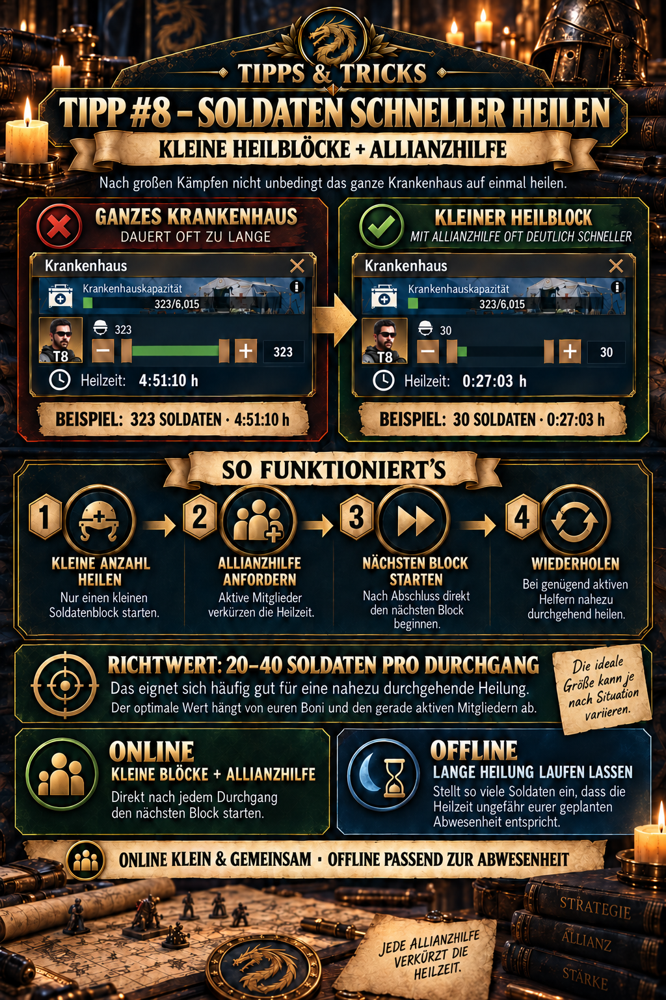
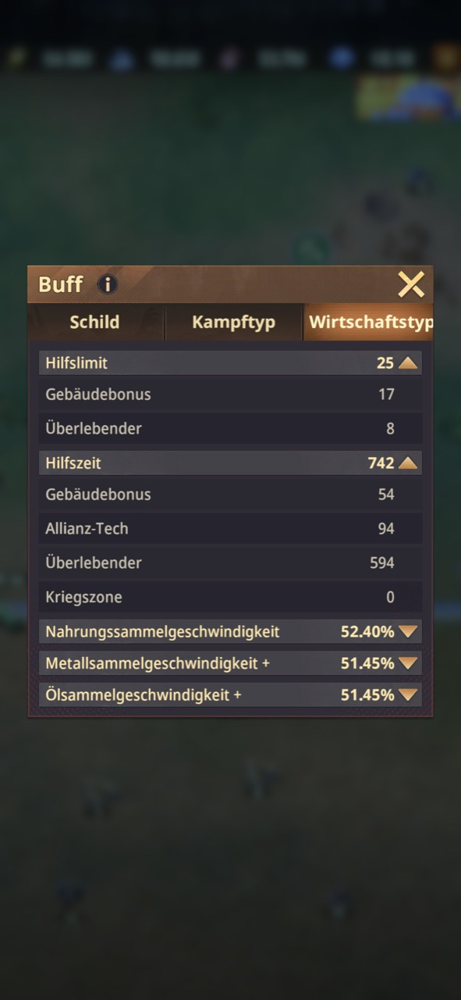

# 💡 Tipp #8 – Soldaten schneller heilen

## Das Wichtigste in Kürze

- **Online in kleinen Blöcken heilen:** Startet nicht automatisch die Heilung des gesamten Krankenhauses.
- **Sofort Allianzhilfe anfordern:** Jede rechtzeitig geleistete Hilfe verkürzt die verbleibende Heilzeit.
- **20–40 Soldaten als Einstieg:** Dieser Bereich eignet sich häufig zum ersten Test; wichtiger ist anschließend die tatsächlich angezeigte Heilzeit.
- **Instant-Zeit berechnen:** Multipliziert eure persönliche **Hilfszeit** mit der Zahl der Mitglieder, die voraussichtlich sofort helfen. Der Heilblock sollte höchstens so lange dauern.
- **Direkt wiederholen:** Sobald ein Block abgeschlossen ist, startet ihr den nächsten und fordert erneut Hilfe an.
- **Offline anders planen:** Vor längerer Abwesenheit stellt ihr einen großen Block ein, dessen Heilzeit ungefähr eurer Offline-Zeit entspricht.

> **Merksatz:** Hilfszeit × sofortige Helfer = maximale Heilzeit für einen Instant-Heal-Block.



## Wofür ist dieser Tipp?

Dieser Tipp zeigt, wie ihr große Mengen verwundeter Soldaten mit kleinen Heilblöcken und wiederholter Allianzhilfe häufig deutlich schneller wieder einsatzbereit macht. Statt eine einzige mehrstündige Heilung anzulegen, wird der Bestand in kurze, von der Allianz gut verkürzbare Abschnitte aufgeteilt.

Die Methode ist besonders nützlich:

- nach großen PvP-Kämpfen,
- wenn das Krankenhaus stark gefüllt ist,
- während noch weitere Kämpfe stattfinden,
- wenn mehrere Allianzmitglieder gleichzeitig online sind,
- oder wenn ihr Diamanten und Heilungsbeschleuniger sparen möchtet.

Sie erfordert jedoch eure aktive Mitarbeit. Wer gleich offline geht, fährt mit einer langen, zur Abwesenheit passenden Heilung besser.

## Warum kleine Heilblöcke funktionieren

Nach dem Start einer Heilung könnt ihr Allianzhilfe anfordern. Aktive Mitglieder drücken anschließend auf „Helfen“ und verkürzen damit die verbleibende Zeit.

Wie viel Zeit jede Hilfe abzieht, steht in euren persönlichen Buffwerten unter **Hilfszeit**. Dieser Wert setzt sich unter anderem aus Gebäudebonus, Allianz-Technologie und Überlebenden zusammen. Zusätzlich begrenzt das **Hilfslimit**, wie viele Hilfen ein einzelner Vorgang höchstens erhalten kann.

Für die Planung zählt aber nicht automatisch das gesamte Hilfslimit. Entscheidend ist, wie viele Mitglieder gerade online sind und voraussichtlich **sofort** auf eure Anfrage reagieren.

Das Prinzip lautet:

```text
kleiner Heilblock → Hilfe anfordern → Helfer verkürzen den Timer →
Block endet → nächsten Heilblock starten
```

Die gewonnene Geschwindigkeit entsteht nicht durch einen einzelnen stärkeren Heilbonus, sondern dadurch, dass ihr den Hilfevorgang bei jedem neuen Block erneut nutzt.

## Online-Heilung Schritt für Schritt

1. Öffnet das Krankenhaus und prüft Anzahl sowie Stufen der Verwundeten.
2. Öffnet eure Buffübersicht und lest **Hilfszeit** sowie **Hilfslimit** ab.
3. Schätzt realistisch, wie viele Mitglieder sofort helfen werden – nicht nur, wie viele als online angezeigt werden.
4. Berechnet daraus eure Instant-Heilzeit.
5. Wählt so viele Soldaten, dass die angezeigte Heilzeit knapp unter diesem Ergebnis liegt.
6. Startet die Heilung.
7. Fordert **sofort Allianzhilfe** an.
8. Sobald der Block abgeschlossen ist, startet ihr unmittelbar den nächsten und fordert erneut Hilfe an.
9. Wiederholt den Ablauf, bis alle gewünschten Soldaten geheilt sind oder ihr offline gehen möchtet.

> **Wichtig:** Der Button für Allianzhilfe muss nach jedem neu gestarteten Heilblock erneut betätigt werden. Eine frühere Hilfsanfrage gilt nicht automatisch für die folgenden Blöcke.

## Die Instant-Heilzeit berechnen

Die Formel lautet:

```text
Instant-Heilzeit = Hilfszeit × erwartete sofortige Helfer
```

Dabei darf die Zahl der angesetzten Helfer das persönliche Hilfslimit nicht überschreiten:

```text
verwendete Helferzahl = kleinerer Wert aus
„erwartete sofortige Helfer“ und „Hilfslimit“
```

Die optimale Heilzeit ist damit **kein allgemeiner Festwert**. Sie verändert sich, wenn eure Hilfszeit steigt oder gerade mehr beziehungsweise weniger Mitglieder reagieren können.

### Konkretes Beispiel aus dem neuen Ingame-Screenshot



*In der Buffübersicht unter „Wirtschaftstyp“ stehen die persönlichen Werte für Hilfslimit und Hilfszeit. Für die Berechnung wird der obere Gesamtwert verwendet – nicht nur einer der darunter aufgeführten Einzelboni.*

Der Screenshot zeigt:

- **Hilfslimit:** 25
  - Gebäudebonus: 17
  - Überlebender: 8
- **Hilfszeit:** 742 Sekunden je Hilfe
  - Gebäudebonus: 54
  - Allianz-Tech: 94
  - Überlebender: 594

Die Bestandteile der Hilfszeit ergeben zusammen 742 Sekunden. Das entspricht **12 Minuten und 22 Sekunden je Hilfe**.

Wenn ihr mit **5 sofortigen Hilfen** rechnet:

```text
742 Sekunden × 5 Helfer = 3.710 Sekunden
3.710 Sekunden = 1 Stunde, 1 Minute und 50 Sekunden
```

Für dieses Profil kann ein Heilblock mit höchstens **1:01:50** durch fünf Hilfen unmittelbar abgeschlossen werden. Praktisch bietet sich eine kleine Sicherheitsreserve an – beispielsweise eine angezeigte Heilzeit von ungefähr **60 Minuten**.

> **Beispielentscheidung:** Sind fünf verlässliche Helfer online, stellt ihr so viele Soldaten ein, bis der Heilungstimer knapp eine Stunde zeigt. Danach Heilung starten, Hilfe anfordern und nach den fünf Hilfen direkt den nächsten Block anlegen.

### Hilfszeit-Tabelle für den Beispielwert 742

| Sofortige Helfer | Gesamte Zeitreduktion | Maximaler Instant-Heal-Block |
| ---: | ---: | ---: |
| 1 | 742 Sekunden | 0:12:22 |
| 2 | 1.484 Sekunden | 0:24:44 |
| 3 | 2.226 Sekunden | 0:37:06 |
| 4 | 2.968 Sekunden | 0:49:28 |
| 5 | 3.710 Sekunden | **1:01:50** |
| 10 | 7.420 Sekunden | 2:03:40 |
| 25 | 18.550 Sekunden | 5:09:10 |

Die Zeile mit 25 Hilfen beschreibt nur das rechnerische Maximum beim angezeigten Hilfslimit. Sie ist nur erreichbar, wenn tatsächlich 25 Mitglieder rechtzeitig helfen.

## Soldatenzahl oder berechnete Heilzeit – welcher Richtwert ist besser?

Die Soldatenzahl ist leicht zu merken, aber die Heilzeit ist genauer.

| Richtwert | Vorteil | Grenze |
| --- | --- | --- |
| **20–40 Soldaten** | schnell einstellbar und guter erster Test | unterschiedliche Soldatenstufen und Boni erzeugen unterschiedliche Zeiten |
| **30–50 Minuten Heilzeit** | brauchbarer allgemeiner Community-Startwert | berücksichtigt die persönliche Hilfszeit und tatsächliche Helferzahl noch nicht exakt |
| **Hilfszeit × erwartete Helfer** | ergibt den persönlichen Instant-Heal-Timer | funktioniert nur, wenn die eingeplanten Mitglieder tatsächlich sofort helfen |

Die bereitgestellte Grafik zeigt beispielsweise:

- **323 Soldaten:** 4:51:10 Stunden Heilzeit
- **30 Soldaten:** 0:27:03 Stunden Heilzeit
- bei **5 Helfern:** ungefähr 37 Minuten mögliche Reduktion als dargestellter Richtwert

Der ältere Grafikwert von ungefähr 37 Minuten gehört zu den damals verwendeten Buffwerten. Mit der nun dokumentierten Hilfszeit von 742 Sekunden reduzieren fünf Helfer dagegen bis zu **1:01:50**. Das zeigt, weshalb weder 20–40 Soldaten noch ein pauschaler 30–50-Minuten-Timer für alle Profile optimal sein kann.

## Die optimale Blockgröße selbst bestimmen

Die beste Blockgröße ist der **größte Block, dessen Heilzeit durch die sofort erwarteten Allianzhilfen vollständig abgedeckt wird**.

### Einfaches Testverfahren

1. Lest eure persönliche Hilfszeit ab.
2. Zählt die Mitglieder, von denen ihr unmittelbar eine Hilfe erwarten könnt.
3. Multipliziert beide Werte und rechnet das Ergebnis in Stunden, Minuten und Sekunden um.
4. Wählt so viele Soldaten, dass der Heilungstimer knapp unter dem Ergebnis liegt.
5. Fordert Hilfe an und kontrolliert, ob alle eingeplanten Mitglieder reagieren.
6. Passt den nächsten Block an:
   - alle Hilfen kommen sofort und der Block endet → Zielzeit beibehalten,
   - weniger Hilfen als erwartet → nächsten Block entsprechend verkleinern,
   - zusätzliche Helfer werden zuverlässig aktiv → nächsten Block neu berechnen.

Auf diese Weise entsteht ein persönlicher Richtwert, der besser ist als eine starre Soldatenzahl.

### Wenn gerade weniger Mitglieder online sind

Mit wenigen Helfern muss der Block kleiner sein, wenn er weiterhin sofort fertig werden soll. Rechnet nur mit Mitgliedern, die voraussichtlich tatsächlich reagieren. Fünf angezeigte Online-Spieler sind nicht automatisch fünf sofortige Hilfen.

Mögliche Reaktionen:

- kleinere Blöcke einstellen,
- im Allianzchat kurz um Hilfe bitten,
- Heilung auf eine aktivere Zeit verschieben, sofern die Krankenhauskapazität das zulässt,
- oder bewusst einen längeren Block starten, wenn ihr ohnehin nicht weiterkämpft.

## Warum das ganze Krankenhaus auf einmal oft ungünstig ist

Eine einzige große Heilung ist bequem, nutzt wiederholte Allianzhilfe während eurer Online-Zeit aber schlecht aus:

- Der Timer kann mehrere Stunden lang sein.
- Die verfügbaren Hilfen reduzieren ihn möglicherweise nicht bis auf null.
- Während der Restzeit könnt ihr keinen neuen Heilblock starten.
- Die Allianz kann erst beim nächsten Auftrag erneut für euch helfen.
- Für eine sofortige Rückkehr in den Kampf werden dann eventuell Beschleuniger oder Diamanten nötig.

Kleine Blöcke erzeugen dagegen viele kurze Heilaufträge. Bei jedem Auftrag kann erneut geholfen werden.

## Wann eine große Heilung trotzdem richtig ist

Die Blockmethode setzt voraus, dass ihr nach Abschluss direkt den nächsten Auftrag anlegt. Wenn ihr schlafen geht, arbeitet oder längere Zeit nicht ins Spiel schaut, würde eine kleine Heilung schnell fertig sein und das Krankenhaus anschließend untätig bleiben.

Wählt vor dem Offlinegehen deshalb so viele Soldaten, dass die Heilzeit ungefähr eurer geplanten Abwesenheit entspricht.

| Situation | Empfohlenes Vorgehen |
| --- | --- |
| Viele Mitglieder online, ihr bleibt aktiv | kleine Blöcke, sofort Hilfe anfordern, direkt wiederholen |
| Wenige Helfer online | kleinere Testblöcke oder längere Heilung akzeptieren |
| Ihr geht nur kurz offline | Block ungefähr bis zu eurer Rückkehr einstellen |
| Ihr geht über Nacht offline | große Heilung mit mehrstündiger Laufzeit starten |
| Kampf läuft weiter und Krankenhaus füllt sich erneut | kurze Blöcke priorisieren und aktiv Hilfe koordinieren |

> **Offline-Regel:** Nicht die kleinste mögliche Menge wählen, sondern die Warteschlange während eurer gesamten Abwesenheit sinnvoll beschäftigen.

## Allianzhilfe richtig koordinieren

Die Methode funktioniert nur, wenn andere Mitglieder tatsächlich auf „Helfen“ drücken. Gute Organisation erhöht deshalb die Wirkung:

- Heilt möglichst zu Zeiten hoher Allianzaktivität.
- Kündigt nach großen Kämpfen im Chat eine gemeinsame Heilphase an.
- Helft auch anderen Mitgliedern konsequent, damit alle ihre Blöcke schnell abschließen können.
- Startet den nächsten Block unmittelbar, solange die Helfer noch online sind.
- Verwendet keine Beschleuniger, bevor die verfügbaren Hilfen eingegangen sind.

Die Allianzforschung kann die persönliche Hilfszeit verbessern. Im Beispiel stammen **94 der insgesamt 742 Sekunden** aus Allianz-Tech. Eine aktive Allianz profitiert daher doppelt: Viele Mitglieder liefern die Hilfen, und stärker ausgebaute Technologie erhöht die Zeitreduktion je Hilfe.

## Heilboni sinnvoll einbeziehen

Heilgeschwindigkeit und Krankenhauskapazität verändern euren persönlichen Idealwert. Insbesondere der taktische Minister aus Tipp 3 bietet nach der vorliegenden Rollenübersicht:

- **+20 % Heilungsgeschwindigkeit**
- **+20 % Krankenhauskapazität**

Wenn ihr einen zeitlich begrenzten Heilbonus erhaltet, kontrolliert den Timer erneut und passt die Blockgröße an. Ein Bonus kann bedeuten, dass ihr bei gleicher Zielzeit mehr Soldaten in einen Block aufnehmen könnt.

Ob ein Bonus nur für nach seiner Aktivierung gestartete Heilungen gilt, sollte anhand der aktuellen Amts- beziehungsweise Bonusbeschreibung geprüft werden. Übertragt Regeln anderer Aktionstypen nicht ungeprüft auf die Heilung.

## Ressourcen, Beschleuniger und „kostenlos heilen“

Community-Guides sprechen teilweise von „kostenloser“ oder „sofortiger“ Heilung. Gemeint ist dabei, dass ein kurzer Block durch Allianzhilfe ohne den Einsatz von **Diamanten oder Beschleunigern** beendet werden kann.

Das bedeutet nicht automatisch, dass keinerlei normale Heilressourcen anfallen. Prüft vor jedem Start den Ressourcenbedarf im Krankenhaus. Die Methode verkürzt in erster Linie die **Zeit** und spart optionale Beschleunigungsmittel.

## Nach großen Kämpfen sinnvoll vorgehen

1. Krankenhausbelegung und verbleibende Kapazität prüfen.
2. Persönliche Hilfszeit und Hilfslimit in der Buffübersicht ablesen.
3. Im Allianzchat feststellen, wie viele Helfer sofort reagieren können.
4. Hilfszeit × erwartete Helfer berechnen.
5. Soldatenzahl so einstellen, dass der Timer knapp unter der berechneten Instant-Zeit liegt.
6. Hilfe anfordern und kontrollieren, ob die erwartete Verkürzung eintritt.
7. Solange ihr online seid, ohne Leerlauf wiederholen.
8. Vor dem Offlinegehen auf einen langen Block wechseln.
9. Nach der Rückkehr Restbestand und Krankenhauskapazität erneut prüfen.

## Typische Fehler

- **Das gesamte Krankenhaus auf einmal heilen:** Dadurch kann die wiederholte Hilfe nicht effizient genutzt werden.
- **Nur nach Soldatenzahl gehen:** 40 hochstufige Soldaten können eine andere Heilzeit haben als 40 niedrigere Soldaten.
- **Hilfslimit mit verfügbaren Helfern verwechseln:** Ein Limit von 25 garantiert nicht, dass 25 Mitglieder online sind und sofort helfen.
- **Mit allen Online-Spielern rechnen:** Plant nur Mitglieder ein, die wahrscheinlich rechtzeitig auf „Helfen“ drücken.
- **Hilfszeit nicht neu prüfen:** Überlebende, Gebäude und Allianz-Tech können den persönlichen Wert verändern.
- **Allianzhilfe zu spät anfordern:** Je früher die Anfrage gestellt wird, desto früher können Mitglieder reagieren.
- **Nach einem Block nicht weitermachen:** Die Methode gewinnt ihre Geschwindigkeit aus der Wiederholung.
- **Bei geringer Aktivität zu große Blöcke wählen:** Ohne genügend Helfer bleibt eine lange Restzeit bestehen.
- **Vor dem Offlinegehen einen Mini-Block starten:** Er endet schnell und lässt die Heilwarteschlange für den Rest der Abwesenheit leer.
- **Beschleuniger sofort einsetzen:** Wartet zunächst ab, wie weit die Allianzhilfe den Timer reduziert.
- **„Kostenlos“ mit ressourcenfrei verwechseln:** Allianzhilfe spart vor allem Zeit, Diamanten und Beschleuniger; normale Heilkosten können weiterhin anfallen.
- **Krankenhauskapazität ignorieren:** Kontrolliert während längerer Kämpfe regelmäßig, wie viel Platz noch verfügbar ist.

## Grenzen und noch zu prüfende Angaben

- Der aktuelle Screenshot zeigt eine Hilfszeit von 742 und ein Hilfslimit von 25. Diese Werte gelten für das gezeigte Profil und nicht automatisch für andere Mitglieder.
- Die Berechnung setzt voraus, dass der Hilfszeitwert in Sekunden vollständig vom Timer abgezogen wird. Das Beispiel sollte einmal mit einem realen Heilblock und fünf Hilfen gegengeprüft werden.
- Der ältere Grafikwert von ungefähr 37 Minuten bei fünf Helfern gehört zu einer anderen Buffkonstellation und wird durch den aktuellen Profilwert nicht allgemein ersetzt.
- 20–40 Soldaten beziehungsweise 30–50 Minuten bleiben nur allgemeine Startbereiche; genauer ist die persönliche Berechnung aus Hilfszeit und zuverlässig verfügbaren Helfern.
- Nicht vollständig dokumentiert ist, wie Soldatenstufe und Verwundungsart die Heilzeit pro Einheit beeinflussen.
- Die Wechselwirkung zwischen taktischem Minister, persönlicher Forschung, Allianzforschung und weiteren Heilboni sollte im aktuellen Timer geprüft werden.
- Krankenhauskapazität, verfügbare Helfer und aktive Kampfsituation können eine andere Priorität erfordern als maximale Zeiteffizienz.

## Quellen und Verlässlichkeit

- **DIE-Ingame-Beleg:** Vergleich zwischen Gesamtheilung und kleinem Block, 20–40 Soldaten als Richtwert, Beispielzeiten, fünf Helfer sowie die Online-/Offline-Strategie stammen aus der bereitgestellten Allianz-Grafik und der freigegebenen Mitteilung.
- **Aktueller Profil-Screenshot:** Die ergänzte Buffansicht dokumentiert ein Hilfslimit von 25 und eine Hilfszeit von 742, aufgeteilt in Gebäudebonus, Allianz-Tech und Überlebendenbonus. Daraus wurde das Beispiel mit fünf Hilfen berechnet.
- **Community-Quelle:** [Z Route Academy – Sofortige Krankenhausheilung](https://zroute.dev/de/combat/hospital-healing/) beschreibt die Blockheilung, einen allgemeinen Zielbereich von ungefähr 30–50 Minuten und den wiederholten Einsatz von Allianzhilfe. Die dort beschriebene prozentuale Verkürzung wird durch den aktuellen Ingame-Wert „Hilfszeit“ präzisiert beziehungsweise sollte für die eigene Spielversion anhand des Timers überprüft werden.
- **Ergänzende Allianzquelle:** [Z Route Academy – Allianzforschung](https://zroute.dev/de/alliance/alliance-research/) beschreibt stärkere Allianzhilfe als Forschungsvorteil, der die durch jedes Mitglied eingesparte Zeit verbessert.
- **Ergänzende Rollenquelle:** [Z Route Academy – Official Positions](https://zroute.dev/alliance/official-positions/) dokumentiert den Community-Stand zum taktischen Minister mit Heilgeschwindigkeits- und Krankenhauskapazitätsbonus.

Die öffentlichen Quellen beruhen überwiegend auf Community-Dokumentation. Verbindlich bleiben deshalb die persönliche Buffanzeige, der aktuelle Heilungsdialog, die tatsächlich eingegangenen Hilfen und der danach verbleibende Timer.

Stand der Recherche: **25.09.2026**.

## Allianz-Mitteilung zum Kopieren

```html
<size=38><color=#8DAA2D><b>💡 TIPP #8 – SOLDATEN SCHNELLER HEILEN</b></color></size>

Nach großen Kämpfen nicht unbedingt das ganze Krankenhaus auf einmal heilen! Mit <color=#8DAA2D><b>kleinen Heilblöcken + Allianzhilfe</b></color> geht es oft deutlich schneller.

🏥 <b>SO FUNKTIONIERT'S:</b>
Heilt nur eine kleine Anzahl Soldaten und fordert anschließend Allianzhilfe an. Sind genügend Mitglieder online, verkürzen deren Hilfen die Heilzeit stark – danach direkt den nächsten Block starten.

💡 <b>RICHTWERT:</b>
Etwa <color=#8DAA2D><b>20–40 Soldaten pro Durchgang</b></color> eignen sich oft gut, um nahezu durchgehend zu heilen. Der optimale Wert hängt von euren Boni und den gerade aktiven Mitgliedern ab.

🌙 <b>WENN IHR OFFLINE GEHT:</b>
Stellt einfach so viele Soldaten ein, dass die Heilzeit ungefähr eurer geplanten Abwesenheit entspricht.

➡️ <color=#8DAA2D><b>Online: kleine Blöcke + Allianzhilfe</b></color>
➡️ <b>Offline: lange Heilung laufen lassen</b>
```
