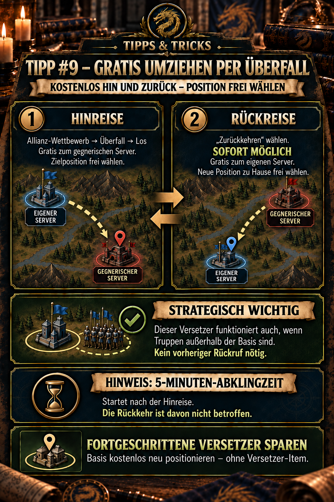

---
arten:
  - Anleitung
  - Optimierung
themen:
  - Events
  - Weltkarte
---

# 💡 Tipp #9 – Gratis umziehen per Überfall

## Das Wichtigste in Kürze

- Öffnet **Allianz-Wettbewerb → Überfall → Los**, um kostenlos auf den gegnerischen Server zu wechseln.
- Beim Wechsel könnt ihr eure Zielposition frei auswählen – ähnlich wie mit einem fortgeschrittenen Versetzer.
- Nach der Hinreise beginnt eine **Abklingzeit von 5 Minuten**. Sie blockiert die Rückreise jedoch nicht.
- Über **„Zurückkehren“** gelangt ihr sofort und kostenlos auf euren eigenen Server zurück.
- Auch bei der Rückkehr könnt ihr eine neue Position für eure Basis auswählen.
- **Strategisch besonders wichtig:** Der Versetzer funktioniert auch, wenn sich Truppen außerhalb der Basis befinden. Ein vorheriger Rückruf ist nicht nötig.
- Damit lässt sich die eigene Basis ohne fortgeschrittenen Versetzer neu positionieren, solange der Überfall verfügbar ist.

> **Merksatz:** Kostenlos zum Gegner springen und über „Zurückkehren“ sofort einen neuen Heimatplatz auswählen – auch mit Truppen außerhalb der Basis.



## Wofür ist dieser Tipp?

Der Überfall ist eigentlich eine serverübergreifende Kampfmechanik. Seine Hin- und Rückreise lässt sich aber auch als kostenloser Versetzer nutzen: Ihr reist zum gegnerischen Server und könnt über „Zurückkehren“ sofort eine neue Position auf eurem Heimatserver auswählen. Die nach der Hinreise gestartete Abklingzeit läuft unabhängig von dieser Rückkehrmöglichkeit.

Anders als bei vielen üblichen Teleport-Situationen müsst ihr dafür nicht erst warten, bis alle Truppen wieder in der Basis stehen. Der kostenlose Versetzer über den Überfall kann auch gestartet werden, während sich Truppen außerhalb befinden. Dadurch bleibt die Methode selbst dann taktisch nutzbar, wenn eure Einheiten gerade unterwegs sind.

Das ist besonders nützlich, wenn ihr:

- näher zu eurer Allianz ziehen möchtet,
- eine ungünstige oder gefährliche Position verlassen wollt,
- eure Formation für ein bevorstehendes Ereignis ordnen möchtet,
- einen Platz in einem Allianzgebiet einnehmen möchtet,
- oder fortgeschrittene Versetzer für Situationen aufheben wollt, in denen der Überfall nicht verfügbar ist.

Der entscheidende Unterschied zu einem normalen Serverwechsel: Ihr wechselt nicht dauerhaft auf einen anderen Server. Die Reise findet innerhalb des zeitlich verfügbaren Überfalls statt und endet mit der Rückkehr auf euren Heimatserver.

## So funktioniert der kostenlose Umzug

Die Methode besteht aus zwei kostenlosen Positionswahlen: einer Hinreise zum gegnerischen Server und der späteren Rückreise auf den eigenen Server.

```text
Allianz-Wettbewerb → Überfall → Los
            ↓
Position auf dem gegnerischen Server wählen
            ↓
„Zurückkehren“ wählen – sofort möglich
            ↓
neue Position auf dem eigenen Server bestimmen

Separater Hinweis: Nach der Hinreise startet eine Abklingzeit
von 5 Minuten. Die Rückkehr ist davon nicht betroffen.
```

### 1. Zum gegnerischen Server reisen

1. Öffnet den **Allianz-Wettbewerb**.
2. Wechselt zum Bereich **Überfall**.
3. Tippt auf **„Los“**.
4. Wählt auf dem gegnerischen Server eine freie Zielposition aus.
5. Kontrolliert vor der Bestätigung, dass für den Wechsel kein Versetzer und keine andere Währung verlangt wird.
6. Bestätigt den Sprung.

Die Position auf dem gegnerischen Server kann nach der vorliegenden Spielerfahrung frei gewählt werden. Dadurch funktioniert die Hinreise ähnlich wie ein fortgeschrittener Versetzer – nur innerhalb des Überfall-Events.

### 2. Sofort kostenlos zurückkehren

1. Öffnet nach der Hinreise erneut den Überfall.
2. Wählt **„Zurückkehren“** – dafür müsst ihr die fünf Minuten nicht abwarten.
3. Sucht auf eurem Heimatserver die gewünschte neue Position.
4. Prüft die Umgebung und bestätigt erst dann die Rückkehr.

Die Rückreise ist nach der dokumentierten Spielerfahrung ebenfalls kostenlos. Entscheidend ist, dass ihr nicht einfach irgendeinen freien Platz bestätigt: Die bei der Rückkehr gewählte Koordinate wird zur neuen Position eurer Basis.

### Die Abklingzeit richtig einordnen

Nach dem Sprung zum Gegner startet zwar eine **5-Minuten-Abklingzeit**, sie ist aber **keine Wartezeit vor der Rückreise**. Die Funktion „Zurückkehren“ bleibt sofort verfügbar.

Der Timer wird deshalb nicht als eigener Schritt zwischen Hin- und Rückreise dargestellt. Welche weitere Überfallaktion er in der jeweils aktuellen Spielversion begrenzt, entnehmt ihr der Ingame-Anzeige.

> **Wichtig:** Hinreise → sofortige Rückreise ist möglich. Die angezeigte Abklingzeit läuft separat und blockiert „Zurückkehren“ nicht.

## Strategisch wichtig: Truppen dürfen außerhalb der Basis sein

Der Versetzer über den Überfall funktioniert auch, wenn sich Truppen außerhalb eurer Basis befinden. Ihr müsst sie vor der Hinreise **nicht zurückrufen** und nicht erst auf ihre Rückkehr warten.

Das ist strategisch besonders wertvoll:

- Die Neupositionierung wird nicht durch weit entfernte Truppen verzögert.
- Ihr könnt eine günstige Gelegenheit zum kostenlosen Umzug sofort nutzen.
- Ein geplanter Stellungswechsel muss nicht allein wegen ausgelagerter Truppen verschoben werden.
- Fortgeschrittene Versetzer lassen sich auch in dieser Situation weiterhin sparen.

Die Aussage betrifft die Voraussetzung für den Versetzer: Truppen außerhalb der Basis verhindern seine Nutzung nicht. Sie sagt nicht automatisch aus, wohin diese Truppen nach dem Umzug laufen oder wie ein bereits aktiver Marsch behandelt wird. Kontrolliert deshalb nach der Neupositionierung die Anzeigen und Rückwege der betroffenen Truppen.

> **Praxisregel:** Truppen außerhalb? Kein Problem für diesen Versetzer – ein vorheriger Rückruf ist nicht erforderlich.

## Warum dadurch ein fortgeschrittener Versetzer gespart wird

Ein fortgeschrittener Versetzer erlaubt die freie Auswahl eines Zielortes. Beim Überfall entsteht derselbe für diesen Tipp relevante Effekt durch die Rückkehrmechanik: Ihr könnt eure Basis auf dem Heimatserver an einer neuen freien Position platzieren, ohne dafür das Item einzusetzen.

| Methode | Position frei wählbar | Verbrauch | Verfügbarkeit |
| --- | :---: | --- | --- |
| Fortgeschrittener Versetzer | Ja | 1 Versetzer | wenn das Item vorhanden und Teleportieren erlaubt ist |
| Überfall-Hinreise | Ja | nach Spielerbeobachtung kostenlos | nur während des verfügbaren Überfalls |
| Rückkehr vom Überfall | Ja | nach Spielerbeobachtung kostenlos | sofort nach der Hinreise; unabhängig von der Abklingzeit |

Der Überfall ersetzt den fortgeschrittenen Versetzer daher nicht vollständig. Er ist vielmehr eine ereignisgebundene Sparmöglichkeit. Für spontane Umzüge außerhalb des Events bleibt ein normaler Versetzer weiterhin wichtig.

Mehr zu den regulären Versetzern findet ihr in **Tipp #4 – Richtig teleportieren**.

## Eine gute neue Position auswählen

Die kostenlose Rückkehr ist besonders wertvoll, wenn ihr die Zielposition vorher plant. Achtet auf:

- **Nähe zur Allianz:** Kurze Wege erleichtern Hilfe, Verstärkung und gemeinsame Aktionen.
- **Freie Stellflächen:** Prüft, ob auch benachbarte Mitglieder noch ausreichend Platz finden.
- **Entfernung zu Gegnern:** Eine optisch gute Position kann strategisch ungünstig sein, wenn starke Gegner direkt daneben stehen.
- **Nähe zu Zielen:** Bei anstehenden Ereignissen können kurze Marschwege wichtiger sein als die perfekte Formation.
- **Rohstofffelder und Laufwege:** Blockiert keine wichtigen Wege und achtet auf die Umgebung der geplanten Allianzformation.
- **Absprachen:** Fragt R4/R5 nach vorgesehenen Reihen, Sektoren oder Sammelpunkten, bevor ihr euch platziert.

Wenn mehrere Mitglieder die Methode gleichzeitig verwenden, sollte die Allianz die gewünschten Plätze vorab markieren oder im Chat koordinieren. Sonst entstehen leicht Lücken oder doppelt belegte Wunschpositionen.

## Sinnvolle Einsatzfälle

### Zur Allianz zurückziehen

Steht eure Basis weit außerhalb des Allianzgebiets, könnt ihr die Rückkehr nutzen, um euch wieder in die gemeinsame Formation zu stellen. Das spart einen fortgeschrittenen Versetzer und verkürzt anschließend viele Marschwege.

### Eine schlechte Position korrigieren

Auch kleine Fehlplatzierungen können stören – etwa wenn eine Basis eine Reihe blockiert oder zu weit vom Zentrum entfernt steht. Mit der kostenlosen Rückkehr lässt sich das korrigieren, ohne ein wertvolles Item für wenige Felder auszugeben.

### Vor einem Ereignis neu formieren

Wenn die Allianz ihre Aufstellung vor einem Kampf- oder Sammelereignis verändert, kann der Überfall eine günstige Gelegenheit zur Neuordnung sein. Die Zielposition sollte allerdings vor dem Sprung bereits feststehen.

### Versetzer als Notfallreserve behalten

Fortgeschrittene Versetzer sind besonders wertvoll, wenn ein schneller Ortswechsel außerhalb des Überfalls notwendig wird. Wer die kostenlose Rückkehr für planbare Umzüge nutzt, behält mehr Items für echte Notfälle.

## Checkliste vor dem Sprung

- Ist der **Überfall** aktuell geöffnet und für euch nutzbar?
- Zeigt die Bestätigung tatsächlich einen kostenlosen Wechsel an?
- Kennt ihr den gewünschten Zielbereich auf dem Heimatserver?
- Ist dort genügend freie Fläche vorhanden?
- Ist die neue Position mit der Allianz abgestimmt?
- Befinden sich Truppen außerhalb der Basis? Das blockiert diesen Versetzer nicht; ein Rückruf ist nicht erforderlich.
- Habt ihr die **5-Minuten-Abklingzeit** für weitere Überfallaktionen berücksichtigt, ohne sie mit einer Rückkehrsperre zu verwechseln?
- Sind laufende Märsche, Kämpfe oder andere Einschränkungen im aktuellen Menü berücksichtigt?
- Habt ihr die aktuellen Hinweise zu Schild und Buffs geprüft?

Der letzte Punkt ist bewusst als Prüfung formuliert: Ob und wie Schutzschilde, Buffs, Märsche oder laufende Kämpfe beim Überfall behandelt werden, ist in den vorliegenden öffentlichen Quellen nicht ausreichend dokumentiert. Verlasst euch deshalb nicht auf zusätzliche Behauptungen, sondern prüft die aktuelle Ingame-Anzeige vor der Bestätigung.

## Typische Fehler

- **Überfall mit dauerhaftem Servertransfer verwechseln:** Es handelt sich um eine zeitlich gebundene Reise zum Gegner und wieder zurück.
- **Abklingzeit als Rückkehrsperre verstehen:** Das ist falsch – „Zurückkehren“ kann sofort gewählt werden.
- **Alle Truppen vorsorglich zurückrufen:** Für diesen Versetzer ist das nicht nötig; Truppen außerhalb der Basis blockieren ihn nicht.
- **Ohne Rückkehrplatz springen:** Legt vorher fest, wo eure Basis anschließend stehen soll.
- **Zu schnell bestätigen:** Prüft Umgebung, Allianzformation und Koordinate, bevor ihr die Rückreise abschließt.
- **Die Methode jederzeit einplanen:** Sie funktioniert nur, wenn der entsprechende Überfall verfügbar ist.
- **Ungeprüft einen Versetzer verwenden:** Öffnet für diese Methode den Weg über Allianz-Wettbewerb und Überfall – nicht das normale Versetzer-Menü.
- **Zusätzliche Effekte annehmen:** Aussagen zu Schilden, Buffs oder laufenden Märschen müssen in der aktuellen Spielversion geprüft werden.
- **Den Timer als unveränderlich ansehen:** Bei Updates kann sich die Abklingzeit ändern; die Ingame-Anzeige hat Vorrang.

## Grenzen und offene Punkte

Die öffentlich auffindbaren Informationen zum Überfall sind begrenzt. Eine externe Community-Quelle bestätigt zwar, dass Spieler während des Allianz-Wettbewerbs auf den gegnerischen Server teleportieren und dort kämpfen können. Die hier beschriebene kostenlose freie Positionswahl bei Hin- und Rückreise sowie die konkrete 5-Minuten-Abklingzeit stammen jedoch aus der bereitgestellten aktuellen Spielerfahrung und der Allianz-Dokumentation.

Vor der Nutzung solltet ihr deshalb kontrollieren:

- ob Hin- und Rückreise weiterhin kostenlos angezeigt werden,
- ob die Position auf beiden Servern weiterhin frei wählbar ist,
- ob der Timer weiterhin 5 Minuten beträgt,
- welche weitere Überfallaktion der Timer aktuell begrenzt – die Rückkehr gehört nach der vorliegenden Spielerfahrung nicht dazu,
- wie außerhalb befindliche Truppen nach der Neupositionierung dargestellt werden und welche Rückwege ihnen das Spiel anzeigt,
- welche Einschränkungen bei laufenden Märschen oder Kämpfen gelten,
- und wie aktive Schilde oder Buffs in der aktuellen Version behandelt werden.

## Quellen und Verlässlichkeit

- **Primärgrundlage:** bereitgestellte aktuelle Spielerbeschreibung und vorhandene Allianz-Grafik zum Überfall.
- **Öffentliche Bestätigung der serverübergreifenden Reise:** [Interserver War – Community-Übersicht bei IMPh](https://imph.info/interserver-war) – beschreibt den Allianz-Wettbewerb und das Teleportieren zum gegnerischen Server.
- **Nicht öffentlich vollständig verifiziert:** kostenloser Hin- und Rückweg, freie Platzwahl bei der Rückkehr und die konkrete 5-Minuten-Abklingzeit. Für diese Details gilt die aktuelle Ingame-Anzeige als maßgeblich.

**Stand:** 26.09.2026

## Allianz-Mitteilung zum Kopieren

```html
<b>💡 TIPP 9 – GRATIS UMZIEHEN PER ÜBERFALL</b>

Der <b>Überfall</b> ist nicht nur zum Kämpfen nützlich – ihr könnt ihn auch als <b>kostenlosen Versetzer</b> verwenden!

➡️ Über <b>Allianz-Wettbewerb → Überfall → Los</b> könnt ihr euch <b>gratis zum gegnerischen Server</b> teleportieren.

➡️ Eure Position könnt ihr dabei <b>frei wählen</b> – genau wie mit einem fortgeschrittenen Versetzer.

➡️ Über <b>Zurückkehren</b> geht es anschließend wieder <b>kostenlos nach Hause</b>. Auch dort könnt ihr eure neue Position frei wählen.

⚔️ <b>STRATEGISCH WICHTIG:</b> Der Versetzer funktioniert auch, wenn sich Truppen außerhalb der Basis befinden. Ihr müsst sie vorher nicht zurückrufen.

⏱️ Nach dem Sprung zum Gegner startet eine <b>5-Minuten-Abklingzeit</b>.

<b>👉 So könnt ihr eure Basis kostenlos neu positionieren und spart fortgeschrittene Versetzer!</b>
```
